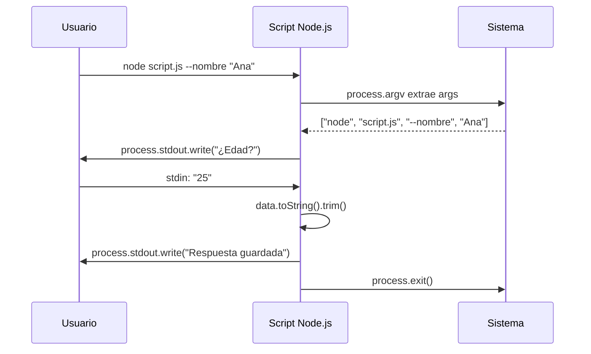

# Interacción con Node.js (CLI)

Node.js nos permite crear herramientas potentes para la terminal. Para ello, necesitamos aprender a leer entradas del usuario y procesar argumentos.

## 📚 Objetivos de Aprendizaje

- Leer datos del usuario desde `stdin`
- Procesar múltiples preguntas con un enfoque recursivo
- Extraer parámetros desde `process.argv`
- Construir una CLI interactiva funcional

## Flujo de una CLI Interactiva



## Lectura de Datos (`stdin`)

La forma más directa de pedir datos es usar los flujos de entrada y salida estándar.

```javascript
process.stdout.write('Dime tu nombre: ');

process.stdin.on('data', function(data){
    process.stdout.write('Hola ' + data.toString());
    process.exit(); // Importante cerrar el proceso
});
```

### Flujo de Trabajo con Eventos
- `process.stdin.on('data', ...)`: Escucha cuando el usuario escribe algo y presiona *Enter*.
- `data.toString()`: Convierte los buffers de datos en texto legible.

---

## Procesando Múltiples Preguntas

Cuando necesitamos una secuencia de datos, es mejor usar un enfoque recursivo o basado en índices:

```javascript
const preguntas = ['Nombre: ', 'Edad: ', 'Lenguaje favorito: '];
const respuestas = [];

function realizarPregunta(i) {
    process.stdout.write(preguntas[i]);
}

process.stdin.on('data', (data) => {
    respuestas.push(data.toString().trim());

    if (respuestas.length < preguntas.length) {
        realizarPregunta(respuestas.length);
    } else {
        console.log("\n--- Resumen ---");
        console.log(respuestas);
        process.exit();
    }
});

realizarPregunta(0);
```

---

## Parámetros y Argumentos (`argv`)

A veces no queremos preguntar, sino pasar la información directamente al ejecutar el script:
`node mi_script.js --nombre "Braulio" --edad 28`

Podemos extraer estos valores buscando en `process.argv`:

```javascript
function obtenerParametro(p) {
    let index = process.argv.indexOf(p);
    return index !== -1 ? process.argv[index + 1] : null;
}

let nombre = obtenerParametro('--nombre');
let edad = obtenerParametro('--edad');

console.log(`Usuario: ${nombre}, Edad: ${edad}`);
```

> [!TIP]
> `process.argv` es un array donde:
> - `[0]` es la ruta de Node.js.
> - `[1]` es la ruta de tu script.
> - `[2...]` son los argumentos que tú pasas.

---

## Relacionado con

- [[fundamentos-sintaxis-variables]] - Variables globales de Node.js y sintaxis básica
- [[estructuras-arrays-objetos]] - Arrays para almacenar respuestas
- [[calculadora-climatica-psicrometrica]] - Proyecto que puede integrarse como CLI
