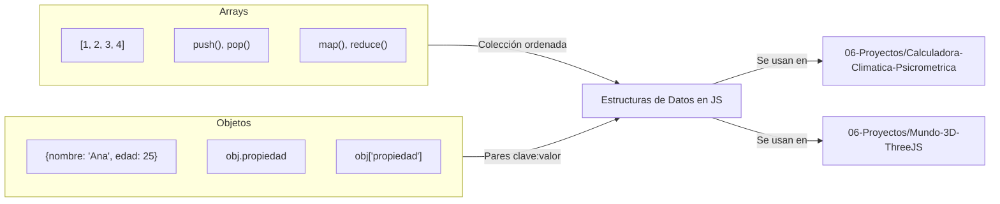
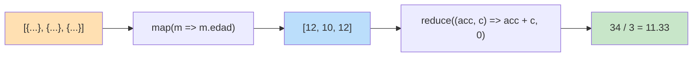

# Estructuras de Datos: Arrays y Objetos

En JavaScript, los **Arrays** y los **Objetos** son las piezas fundamentales para organizar la información.

## 📚 Objetivos de Aprendizaje

- Manipular arrays con métodos de transformación (`map`, `reduce`, `push`, `pop`)
- Crear y modificar objetos (pares clave/valor)
- Aplicar igualdad estricta (`===`) en comparaciones
- Resolver problemas combinando arrays y objetos

## Arrays vs Objetos



## Arrays (Listas)

Los arrays se usan para colecciones de elementos. Tienen métodos poderosos para transformar datos sin usar bucles tradicionales.

### Métodos de Transformación

| Método | Acción | Equivalente en Python |
| :--- | :--- | :--- |
| `push()` | Añade al final | `append()` |
| `pop()` | Elimina el último | `pop()` |
| `unshift()` | Añade al inicio | `insert(0, x)` |
| `shift()` | Elimina el primero | `pop(0)` |
| `map()` | Transforma cada elemento | List Comprehension |

### Flujo de Transformación con map y reduce



### Ejemplo Práctico: Procesando Mascotas

Supongamos que tenemos una lista de mascotas y queremos calcular la edad promedio:

```javascript
const mascotas = [
  { nombre: 'Puchini', edad: 12, tipo: 'perro' },
  { nombre: 'Pulga', edad: 10, tipo: 'perro' },
  { nombre: 'Pelusa', edad: 12, tipo: 'gato' },
];

// 1. Extraemos solo las edades
const edades = mascotas.map(m => m.edad); // [12, 10, 12]

// 2. Sumamos y calculamos el promedio
const suma = edades.reduce((acc, curr) => acc + curr, 0);
console.log(`Edad promedio: ${suma / edades.length}`);
```

---

## Objetos (Diccionarios)

Los objetos son colecciones de pares `clave: valor`. Son extremadamente flexibles.

- **Acceso Directo**: Puedes usar `objeto.propiedad` o `objeto['propiedad']`.
- **Flexibilidad**: No es obligatorio poner comillas en las claves (keys).

### Ejercicio: Gestión de Álbumes (Record Collection)

Crea una función que actualice una colección de discos basándose en reglas específicas:

```javascript
const records = {
  2548: { albumTitle: 'Slippery When Wet', artist: 'Bon Jovi', tracks: [] }
};

function updateRecords(id, prop, value) {
  if (value === "") {
    delete records[id][prop];
  } else if (prop === "tracks") {
    records[id].tracks = records[id].tracks || [];
    records[id].tracks.push(value);
  } else {
    records[id][prop] = value;
  }
}
```

---

## Reto: Seguimiento de Mahjong

Utiliza tus conocimientos de objetos y arrays para crear un sistema que cuente las fichas de Mahjong usando inputs de tipo checkbox en HTML.

> [!TIP]
> **Igualdad en JS**: Siempre usa `===` (Igualdad estricta) para comparar valor y tipo. Evita `==` ya que intenta convertir los tipos automáticamente (ej. `3 == '3'` es `true`, pero `3 === '3'` es `false`).

---

## Relacionado con

- [[fundamentos-sintaxis-variables]] - Variables y tipos de datos fundamentales
- [[CLI-interaccion-terminal]] - Arrays para manejar argumentos y respuestas
- [[calculadora-climatica-psicrometrica]] - Procesamiento de datos meteorológicos
- [[mundo-3D-ThreeJS]] - Objetos 3D y escenas con Three.js
