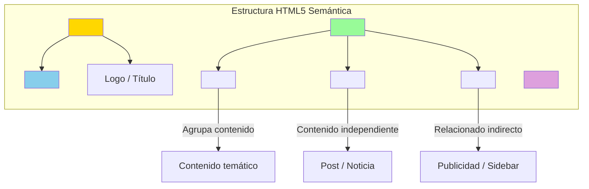

# Web Semántica y HTML5 Moderno

Escribir HTML no es solo poner etiquetas; es dar significado al contenido para que los motores de búsqueda (SEO) y las tecnologías de asistencia puedan entenderlo.

## 📚 Objetivos de Aprendizaje

- Identificar y usar etiquetas semánticas de HTML5
- Implementar imágenes responsivas con `<picture>`
- Crear gráficos vectoriales escalables con SVG
- Usar `<details>`/`<summary>` para contenido colapsable nativo
- Navegación interna con anclas

## Estructura Semántica de una Página



## Estructura Semántica

Olvídate de usar `<div>` para todo. HTML5 introdujo etiquetas que describen su función:

| Etiqueta | Propósito |
| :--- | :--- |
| `<header>` | Encabezado de la página o sección. Contiene el logo o menú. |
| `<nav>` | Bloque de enlaces de navegación. |
| `<main>` | El contenido principal y único de la página. |
| `<section>` | Una sección temática dentro del contenido. |
| `<article>` | Contenido independiente que tiene sentido por sí solo (ej. un post). |
| `<aside>` | Contenido relacionado de forma indirecta (publicidad, barras laterales). |
| `<footer>` | Pie de página con contactos y copyright. |

---

## Multimedia Inteligente

### El elemento `<picture>`

Permite al navegador elegir la mejor imagen según el tamaño de la pantalla, ahorrando datos en móviles.

```html
<picture>
  <source media="(min-width: 800px)" srcset="banner-hd.jpg">
  <source media="(min-width: 450px)" srcset="banner-tablet.jpg">
  
</picture>
```

### Gráficos Vectoriales (SVG)

Los SVGs son código XML. Son infinitamente escalables y perfectos para iconos y logotipos.

```html
<svg width="24" height="24" viewBox="0 0 24 24">
  <path d="M12 2L1 21h22L12 2z" fill="blue" />
</svg>
```

---

## Detalles y Resúmenes

Puedes crear secciones colapsables nativas sin necesidad de JavaScript complejo:

```html
<details>
  <summary>Haz clic para ver más información</summary>
  <p>Aquí puedes poner detalles técnicos que no necesitan estar visibles siempre.</p>
</details>
```

---

## Navegación Interna

Usa anclas para saltar a partes específicas de la misma página usando el `id`:
`<a href="#contacto">Ir al contacto</a>` -> `<section id="contacto">...</section>`

---

## Relacionado con

- [[CSS-tecnicas-layout]] - CSS para estilizar la estructura semántica
- [[calculadora-climatica-psicrometrica]] - Interfaz HTML para la calculadora
- [[mundo-3D-ThreeJS]] - Renderizado 3D en canvas HTML
