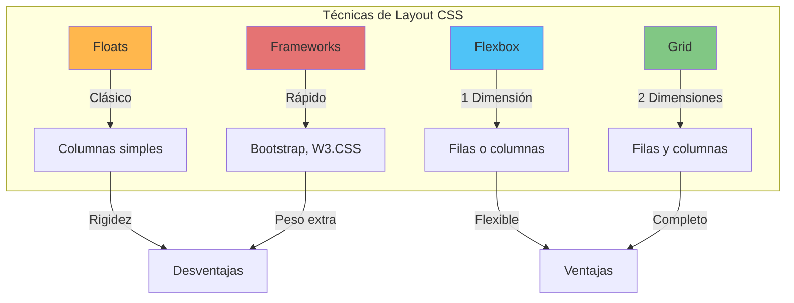
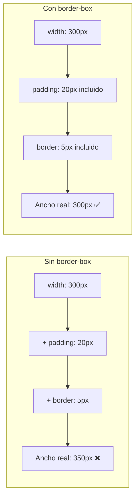

# Técnicas de Layout en CSS

Diseñar la estructura de una página web ha evolucionado drásticamente. Existen cuatro formas principales de organizar tus elementos en pantalla.

## 📚 Objetivos de Aprendizaje

- Comparar las 4 técnicas principales de layout CSS
- Entender el modelo de caja y `box-sizing`
- Crear layouts con `float` y `clearfix`
- Implementar diseño responsivo con Media Queries
- Conocer Flexbox y Grid

## Comparativa de Técnicas de Layout



## Comparativa de Técnicas

| Técnica | Ventajas | Desventajas |
| :--- | :--- | :--- |
| **Floats** | Fácil de aprender, compatible con navegadores antiguos. | Rígido, requiere "limpiar" los flujos (`clear: both`). |
| **Flexbox** | Ideal para alinear elementos en una dimensión (filas o columnas). | Menos eficiente para layouts 2D complejos. |
| **Grid** | Sistema de rejilla completo (2D). Control total de filas y columnas. | Curva de aprendizaje un poco más alta. |
| **Frameworks** | Rapidez extrema (Bootstrap, W3.CSS). | Añade peso extra y estilos predefinidos difíciles de cambiar. |

---

## Entendiendo el Modelo de Caja (`Box Sizing`)



Para que tus layouts no se rompan al añadir padding o bordes, usa siempre:
```css
* {
  box-sizing: border-box;
}
```
Esto asegura que el ancho (`width`) incluya el padding y el borde, evitando que los elementos "empujen" a otros fuera de su lugar.

---

## La técnica del Float (Clásica)

Antiguamente, se usaba `float` para crear columnas. Requiere que los elementos tengan un ancho definido.

```css
nav {
  float: left;
  width: 30%;
  background-color: #f1f1f1;
}

article {
  float: right;
  width: 70%;
  background-color: white;
}
```

---

## Diseño Responsivo (`Media Queries`)

Permite cambiar el layout dependiendo del tamaño de la pantalla. Por ejemplo, pasar de 2 columnas a 1 sola en móviles:

```css
@media (max-width: 600px) {
  nav, article {
    width: 100%;
    float: none;
  }
}
```

---

## Herramientas Modernas

- **Flexbox**: Usa `display: flex;` en el contenedor.
- **Grid**: Usa `display: grid;` y define `grid-template-columns`.

---

## Relacionado con

- [[HTML5-semantico-accesibilidad]] - HTML semántico que se estiliza con CSS
- [[calculadora-climatica-psicrometrica]] - Interfaz con estilos CSS
- [[oportunidades-ecosistema-JS]] - Frameworks CSS en el ecosistema laboral
