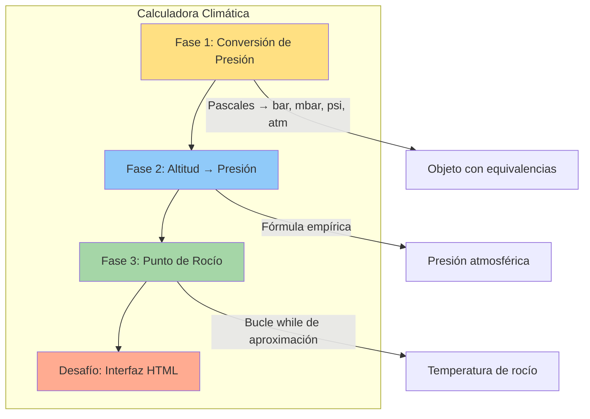
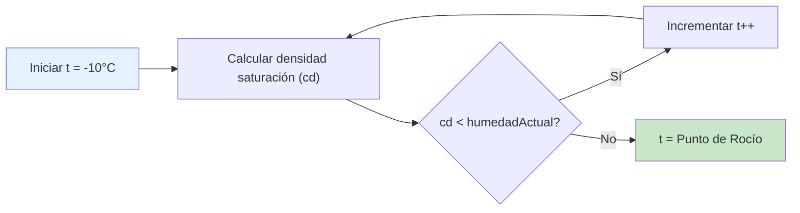

# Proyecto: Calculadora Climática y Psicrométrica

Este proyecto consiste en crear una herramienta técnica para realizar cálculos meteorológicos. Aprenderás a usar lógica matemática avanzada y manipulación de variables físicas.

## 📚 Objetivos de Aprendizaje

- Implementar conversión de unidades de presión
- Calcular presión atmosférica según altitud
- Determinar el punto de rocío con un bucle de aproximación
- Integrar lógica en una interfaz HTML interactiva

## Arquitectura del Proyecto



## Fase 1: Conversión de Unidades

Implementa una función que reciba la presión en Pascales y devuelva un objeto con sus equivalencias.

```javascript
function conversionPresion(P) {
    return {
        bar: P / 100000,
        mbar: P / 100,
        psi: P / 6895,
        atm: P / 101325
    };
}
```

---

## Fase 2: Altitud y Presión

Usa fórmulas empíricas para relacionar la altura con la presión.

```javascript
// Altitud a Presión
function calcularPresion(H) {
    if (H >= -500 && H <= 11000) {
        return 1013.25 * Math.pow((1 - 0.0000225577 * H), 5.2559);
    }
}
```

---

## Fase 3: El Reto del Punto de Rocío

El punto de rocío es la temperatura a la que el aire se satura. Como no hay una fórmula lineal simple, usaremos un bucle `while` para encontrar el valor donde la densidad de saturación iguala a la humedad actual.

### Lógica del Algoritmo



```javascript
function calcularPuntoRocio(humedadActual) {
    let t = -10;
    let cd = 0;
    while (cd < humedadActual) {
        // Fórmula empírica de saturación
        cd = 5.018 + (0.32321 * t) + (8.1847e-3 * t * t); 
        t++;
    }
    return t;
}
```

---

## Desafío Extra

Añade una interfaz HTML con inputs para que el usuario pueda ingresar la temperatura y la altitud, y ver los resultados en tiempo real usando el evento `oninput`.

---

## Relacionado con

- [[fundamentos-sintaxis-variables]] - Variables, constantes y sintaxis JS
- [[CLI-interaccion-terminal]] - Entrada/salida de datos en consola
- [[estructuras-arrays-objetos]] - Objetos para almacenar resultados
- [[HTML5-semantico-accesibilidad]] - Interfaz HTML semántica
- [[CSS-tecnicas-layout]] - Estilos para la interfaz
