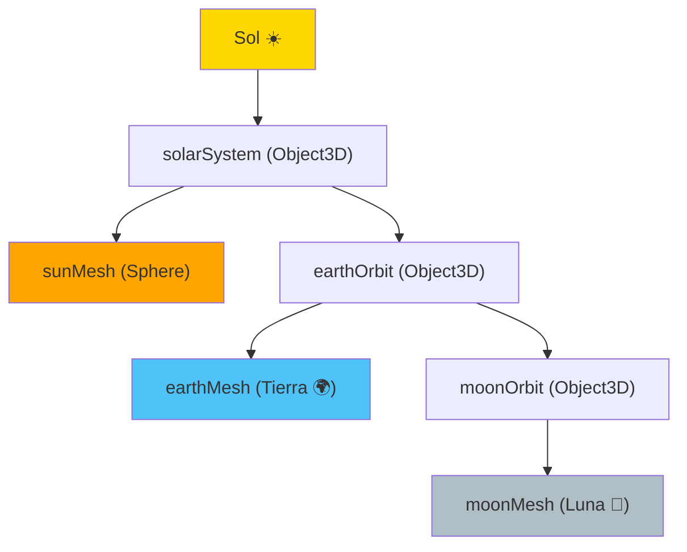

# Proyecto: Mundo 3D con Three.js

Three.js es la librería líder para crear gráficos 3D en la web usando WebGL. En este proyecto, construiremos desde un simple cubo hasta un pequeño sistema solar.

## 📚 Objetivos de Aprendizaje

- Configurar una escena 3D con Three.js
- Crear primitivas 3D con geometrías y materiales
- Implementar un grafo de escena para animaciones orbitales
- Animar objetos con `requestAnimationFrame`

## Pipeline de Renderizado 3D

```mermaid
graph LR
    subgraph "Escena Three.js"
        S[Scene] --> R[Renderer]
        C[Camera] --> R
        M[Mesh] --> S
    end
    
    subgraph "Malla 3D (Mesh)"
        G[Geometry<br/>Box, Sphere, Torus] + MT[Material<br/>Phong, Standard] --> M
    end
    
    R -->|"WebGL"| Canvas["Canvas HTML"]
    
    A["Animation Loop<br/>requestAnimationFrame"] -->|"Actualiza rotación"| M
    
    style S fill:#E1BEE7
    style C fill:#BBDEFB
    style R fill:#C8E6C9
    style Canvas fill:#FFE0B2
```

## Fase 1: El Escenario Base

Para renderizar 3D necesitas tres elementos básicos:
1. **Escena**: Donde viven los objetos.
2. **Cámara**: Tu punto de vista.
3. **Renderer**: El motor que dibuja los píxeles en el `<canvas>`.

```javascript
import * as THREE from 'three';

const scene = new THREE.Scene();
const camera = new THREE.PerspectiveCamera(75, window.innerWidth / window.innerHeight, 0.1, 1000);
const renderer = new THREE.WebGLRenderer();
renderer.setSize(window.innerWidth, window.innerHeight);
document.body.appendChild(renderer.domElement);
```

---

## Fase 2: Primitivas y Materiales

Un objeto 3D (Mesh) es la unión de una **Geometría** (forma) y un **Material** (color/textura).

| Geometría | Forma |
| :--- | :--- |
| `BoxGeometry` | Cubo |
| `SphereGeometry` | Esfera |
| `TorusGeometry` | Dona / Anillo |

```javascript
const geometry = new THREE.BoxGeometry(1, 1, 1);
const material = new THREE.MeshPhongMaterial({ color: 0x44aa88 });
const cube = new THREE.Mesh(geometry, material);
scene.add(cube);

// Necesitamos luz para ver el material Phong
const light = new THREE.DirectionalLight(0xFFFFFF, 3);
light.position.set(-1, 2, 4);
scene.add(light);
```

---

## Fase 3: Grafo de Escena (Sistema Solar)

Un **Grafo de Escena** permite que unos objetos dependan de otros. Si la Tierra orbita al Sol, y la Luna a la Tierra, mover el Sol debería mover a todos.



Usa `THREE.Object3D()` como contenedores invisibles para las órbitas:

```javascript
const solarSystem = new THREE.Object3D();
scene.add(solarSystem);

const sunMesh = new THREE.Mesh(sphereGeometry, sunMaterial);
solarSystem.add(sunMesh);

const earthOrbit = new THREE.Object3D();
earthOrbit.position.x = 10;
solarSystem.add(earthOrbit); // La órbita de la Tierra es hija del Sistema Solar
```

---

## Fase 4: Animación

Usa `requestAnimationFrame` para crear un bucle infinito que actualice la rotación en cada frame.

```javascript
function render(time) {
    time *= 0.001; // Convertir a segundos
    cube.rotation.x = time;
    cube.rotation.y = time;
    
    renderer.render(scene, camera);
    requestAnimationFrame(render);
}
requestAnimationFrame(render);
```

---

## Retos de Aprendizaje

- **Interacción**: Implementa `OrbitControls` para que el usuario pueda rotar la cámara con el ratón.
- **Shaders**: Investiga cómo usar `ShaderMaterial` para importar efectos visuales desde **Shadertoy**.

---

## Relacionado con

- [[fundamentos-sintaxis-variables]] - Sintaxis JS y módulos (import)
- [[estructuras-arrays-objetos]] - Objetos para configurar materiales
- [[HTML5-semantico-accesibilidad]] - Canvas HTML donde se renderiza
- [[oportunidades-ecosistema-JS]] - Three.js en el ecosistema profesional
