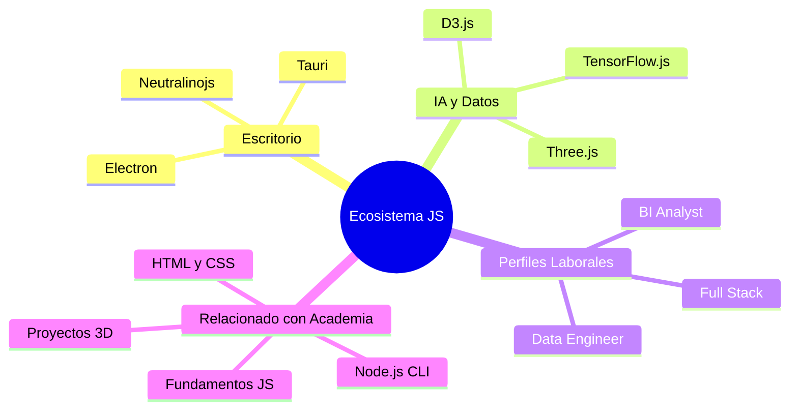

# Oportunidades y Ecosistema de JavaScript

JavaScript ya no es solo para validar formularios. Su ecosistema se ha expandido al escritorio, servidores y el campo de la Inteligencia Artificial.

## 📚 Objetivos de Aprendizaje

- Conocer las aplicaciones de JS más allá del navegador
- Identificar oportunidades laborales en el ecosistema JS
- Explorar frameworks de escritorio (Electron, Tauri, Neutralino)
- Descubrir JS en IA y visualización de datos

## Mapa del Ecosistema JS

## Aplicaciones de Escritorio

Si sabes hacer una web, sabes hacer una aplicación de escritorio gracias a estos frameworks:

- **Electron.js**: El estándar de la industria (VS Code, Discord). Usa Node.js y Chromium.
- **Tauri**: La alternativa moderna. Usa **Rust** en el backend y el motor nativo del SO, lo que lo hace mucho más ligero.
- **Neutralinojs**: Enfocado en ejecutables ultra ligeros.

---

## JavaScript en IA y Datos

Aunque Python es el rey de la IA, JavaScript está ganando terreno en el procesamiento de datos y despliegue de modelos:

- **TensorFlow.js**: Para ejecutar modelos de ML directamente en el navegador.
- **Data Analysis**: Empresas como *Big Bang Data* o *UPB* buscan perfiles que dominen SQL y Python, pero el dominio de JS permite crear visualizaciones interactivas de esos datos (ej. con D3.js o [[mundo-3D-ThreeJS|Three.js]]).

---

## Perfiles Buscados

Basado en las tendencias actuales, estos son los roles donde JavaScript es una pieza clave:

1. **Ingeniero de Datos (Data Engineer)**: Dominio de SQL, Python y automatización con scripts de [[CLI-interaccion-terminal|Node.js]].
2. **BI Analyst**: Visualización de datos y creación de Dashboards dinámicos.
3. **Desarrollador Full Stack**: Dominio de frameworks como React/Angular y backends en Node.js.

---

## Recursos para Seguir Aprendiendo

### Rust (El compañero ideal de JS hoy)
- [The Rust Book](https://rust-book.cs.brown.edu/)
- [Rust by Example](https://doc.rust-lang.org/stable/rust-by-example/)

### Python para Frontend
- **Flet**: Si quieres usar Python para hacer interfaces que se sienten como Flutter.

---

## Relacionado con

- [[fundamentos-sintaxis-variables]] - Base del lenguaje para cualquier perfil
- [[CLI-interaccion-terminal]] - Automatización con scripts Node.js
- [[estructuras-arrays-objetos]] - Manejo de datos estructurados
- [[HTML5-semantico-accesibilidad]] - Base HTML para dashboards
- [[CSS-tecnicas-layout]] - Diseño de interfaces profesionales
- [[calculadora-climatica-psicrometrica]] - Proyecto práctico tipo Data Engineer
- [[mundo-3D-ThreeJS]] - Visualización 3D avanzada
