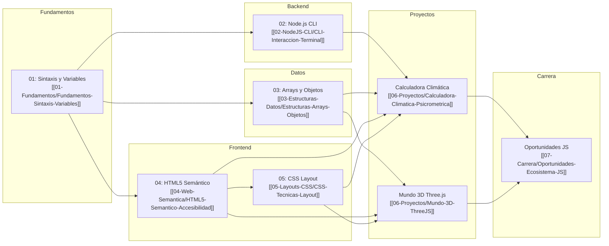

# Academia JavaScript

Bienvenido a la Academia JS. Este repositorio contiene una ruta de aprendizaje progresiva desde los fundamentos del lenguaje hasta proyectos avanzados y oportunidades profesionales.

## Ruta de Aprendizaje

## Módulos

| Módulo | Descripción |
| :--- | :--- |
| [[fundamentos-sintaxis-variables\|Fundamentos]] | Sintaxis, variables (`var`/`let`/`const`), template literals |
| [[CLI-interaccion-terminal\|Node.js CLI]] | Aplicaciones de terminal con stdin/stdout y `process.argv` |
| [[estructuras-arrays-objetos\|Estructuras de Datos]] | Arrays, Objetos, métodos de transformación |
| [[HTML5-semantico-accesibilidad\|Web Semántica]] | HTML5 semántico, SVG, `<picture>`, accesibilidad |
| [[CSS-tecnicas-layout\|Layouts CSS]] | Floats, Flexbox, Grid, Media Queries |
| [[calculadora-climatica-psicrometrica\|Calculadora Climática]] | Proyecto: conversión de unidades, presión, punto de rocío |
| [[mundo-3D-ThreeJS\|Mundo 3D Three.js]] | Proyecto: gráficos 3D, sistema solar, animación |
| [[oportunidades-ecosistema-JS\|Carrera JS]] | Oportunidades laborales, ecosistema, recursos |
