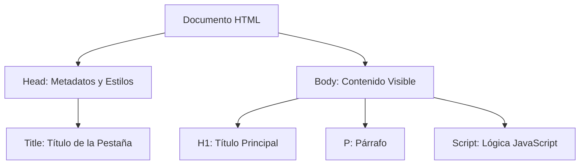

# Lección 01: Mi Primera Página

Esta es la base minimalista para construir una web. Una página web típica se compone de etiquetas que definen su estructura, estilo y comportamiento.

## Estructura Básica
Toda página HTML comienza con una declaración de tipo de documento y se divide principalmente en dos secciones: `head` (encabezado) y `body` (cuerpo).



### Código de Ejemplo
A continuación, el código de nuestra primera página:

```html
<!DOCTYPE html>
<html>
    <head>
        <title>Mi Primera Página</title>
        <style>
            body { background-color: Moccasin; }
        </style>
    </head>
    <body>
        <h1 id="titulo" onmouseover="ponerTituloRojo()">Bienvenido al curso de JavaScript</h1>
        <h2>El primer paso es el más grande</h2>
        <p>Esta página es muy sencilla, pero es la base fundamental.</p>

        <script>
            // Función para cambiar el color del título
            function ponerTituloRojo(){
                document.getElementById("titulo").style="color: red"
            }
        </script>
    </body>
</html>
```

### Conceptos Clave
- **Comentarios:** En HTML se escriben como `<!-- comentario -->`, en JS como `//` o `/* */`.
- **Interactividad:** Usamos el atributo `onmouseover` para ejecutar una función de JavaScript cuando el usuario pasa el mouse sobre un elemento.
- **Estilos:** La etiqueta `<style>` nos permite cambiar la apariencia (colores, fuentes) de la página.

---
[[00-indice-curso|Índice]] | [[01-02-etiquetas|Siguiente: Etiquetas de Texto ->]]
