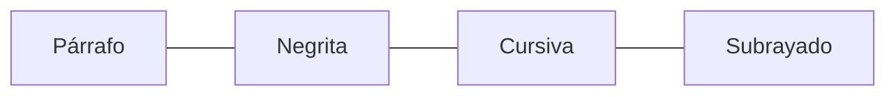

# Lección 03: Etiquetas Anidadas

La anidación consiste en colocar unas etiquetas dentro de otras para combinar sus efectos y significados.

## El Concepto de "Contenedor"
Imagina que las etiquetas son cajas. Puedes poner una caja de "Negrita" dentro de una caja de "Párrafo".



### Ejemplo Práctico
```html
<p>
    Esto es un párrafo y dentro hay 
    <b>una palabra resaltada y es <i>cursiva</i> y esta es <u>subrayada</u></b>
</p>
```

### Reglas de Oro
1. **Cierre en orden inverso:** La última etiqueta que abres debe ser la primera que cierras.
   - ✅ Correcto: `<b><i>Texto</i></b>`
   - ❌ Incorrecto: `<b><i>Texto</b></i>`
2. **Jerarquía:** Mantén el código indentado (tabulado) para ver claramente qué etiqueta contiene a cuál.

---
[[01-02-etiquetas|<- Anterior]] | [[00-indice-curso|Índice]] | [[01-04-orden-del-texto|Siguiente: Texto Ordenado ->]]
