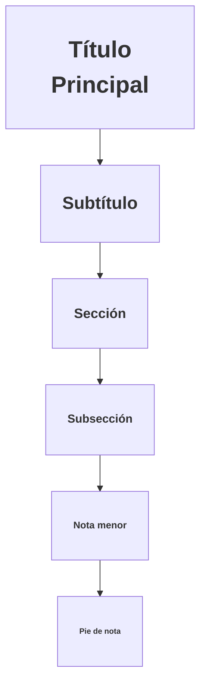

# Lección 05: Encabezados

Los encabezados (`Headings`) definen la jerarquía y estructura del contenido en una página.

## Niveles de Jerarquía
Existen 6 niveles, donde `h1` es el más importante y `h6` el menos.



### Código de Ejemplo
```html
<h1>Yo soy el más importante</h1>
<h2>Soy el segundo</h2>
<h3>Ahora sigo yo</h3>
<h4>El cuarto también cuenta</h4>
<h5>No me dejen último</h5>
<h6>Casi me quedo afuera</h6>
<p>Yo soy un párrafo normal</p>
```

> [!WARNING]
> Solo debe haber un `<h1>` por página. Esto es crucial para el SEO (posicionamiento en buscadores) y la accesibilidad.

---
[[01-04-orden-del-texto|<- Anterior]] | [[00-indice-curso|Índice]] | [[01-06-imagenes|Siguiente: Imágenes ->]]
