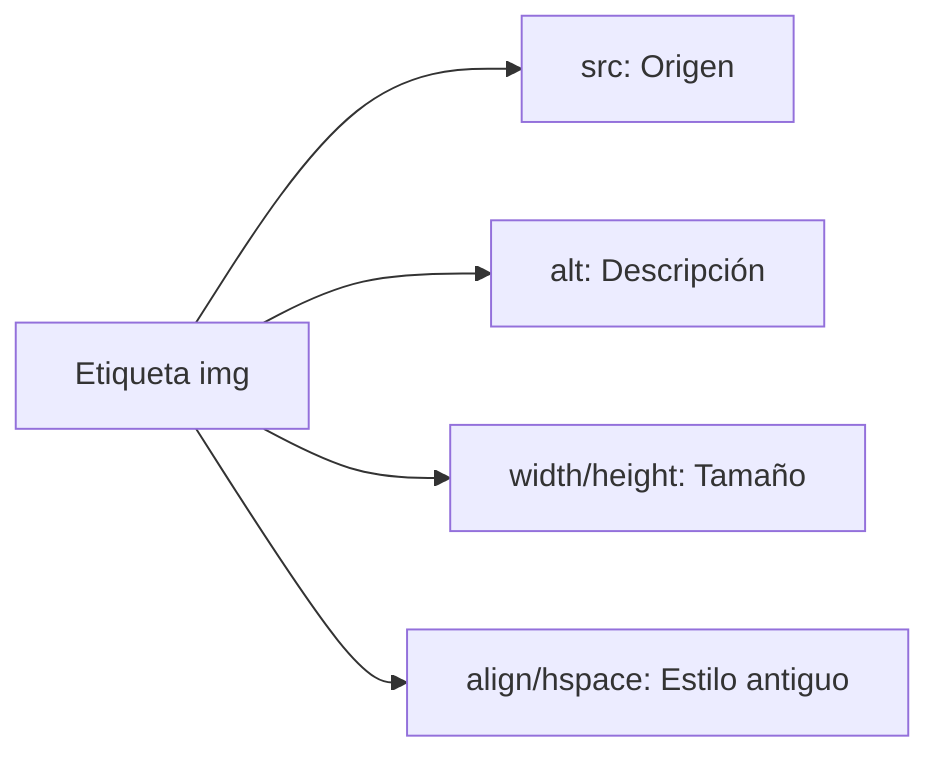

# Lección 06: Imágenes

Las imágenes se insertan con la etiqueta ``, que es una etiqueta de auto-cierre (no necesita `</img>`).

## Atributos Principales
- `src`: La ruta (URL o archivo local) de la imagen.
- `alt`: Texto alternativo si la imagen no carga (fundamental para lectores de pantalla).
- `width` / `height`: Dimensiones de la imagen.

### Ejemplo: El Tucán
```html

```

### Anatomía de la etiqueta 


---
[[01-05-encabezados|<- Anterior]] | [[00-indice-curso|Índice]] | [[01-07-enlaces|Siguiente: Enlaces ->]]
