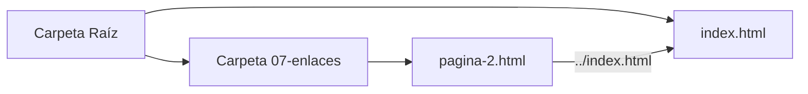

# Lección 07: Enlaces

Los enlaces o hipervínculos son la esencia de la web, permitiendo conectar una página con otra.

## La Etiqueta `<a>`
Se utiliza la etiqueta `<a>` (Anchor) con el atributo `href` para indicar el destino.

### Tipos de Enlaces
1. **Externos:** Apuntan a otros sitios web.
   ```html
   <a href="https://wikipedia.org" target="_blank">Ir a Wikipedia</a>
   ```
2. **Internos (Mismo nivel):** Apuntan a archivos en la misma carpeta.
   ```html
   <a href="pagina-2.html">Ir a la página 2</a>
   ```
3. **Internos (Navegación entre carpetas):** Usamos `../` para subir un nivel en la estructura de carpetas.

### Ejemplo de Navegación Relativa
Si estamos dentro de una subcarpeta (ej: `07-enlaces/pagina-2.html`) y queremos volver al archivo principal en la raíz:

```html
<!-- El "../" le indica al navegador que suba un nivel -->
<a href="../index.html">Volver al Inicio</a>
```



### Atributo `target="_blank"`
Sirve para que el enlace se abra en una pestaña nueva, evitando que el usuario abandone nuestra página actual.

---
[[01-06-imagenes|<- Anterior]] | [[00-indice-curso|Índice]] | [[01-08-biografia|Siguiente: Proyecto Biografía ->]]
