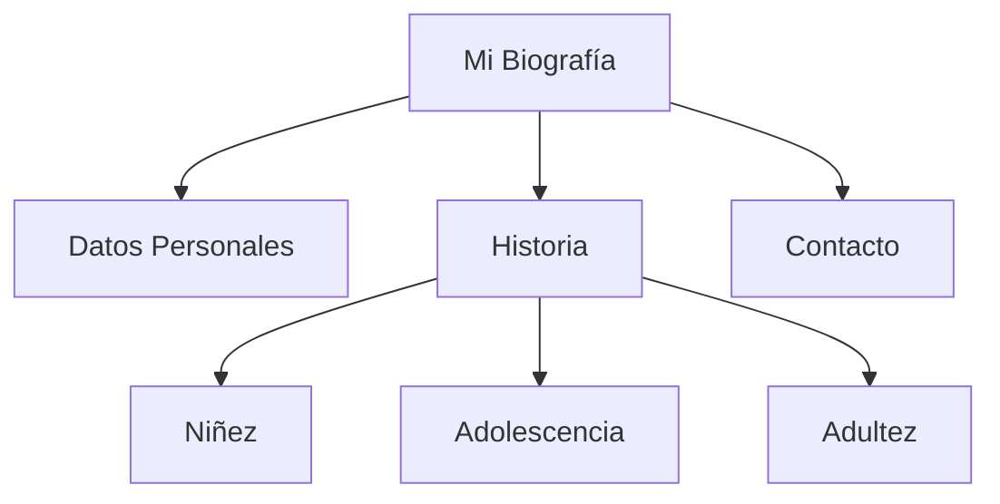

# Lección 08: Proyecto - Mi Biografía

¡Es hora de poner en práctica todo lo aprendido en el Módulo 01!

## El Desafío
Crea una página que cuente tu historia personal utilizando las etiquetas que hemos visto.

### Requerimientos
Tu biografía debe incluir:
- **Encabezados:** Tu nombre (H1) y secciones (H2).
- **Listas:** Datos personales, estudios o hobbies.
- **Imágenes:** Una foto tuya o de algo que te represente.
- **Enlaces:** Vínculos a tus redes sociales o sitios de interés.
- **Tablas:** (Opcional) Para organizar datos como "Año | Evento".

### Estructura Sugerida

---
[[01-07-enlaces|<- Anterior]] | [[00-indice-curso|Índice]] | [[Módulo 02: HTML Intermedio|Siguiente Módulo ->]]
