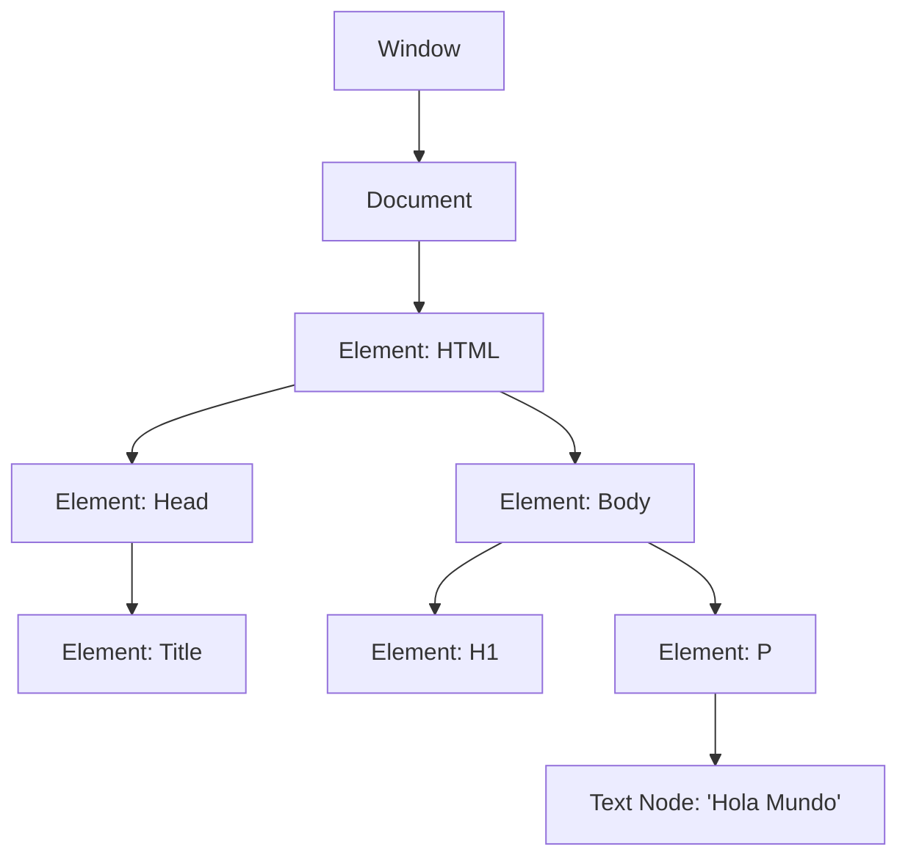

# Lección 02: El DOM (Document Object Model)

El **DOM** es el concepto más importante para entender cómo JavaScript interactúa con una página web.

## ¿Qué es el DOM?
Es una interfaz de programación que representa el documento HTML como una estructura de **árbol**. Cada etiqueta, atributo y pedazo de texto es un "nodo" en este árbol.

### ¿Para qué sirve?
Gracias al DOM, JavaScript puede:
1. **Cambiar** el contenido de una página (texto, imágenes).
2. **Modificar** los estilos (colores, tamaños).
3. **Reaccionar** a eventos (clics, teclas).

---
[[02-01-estilo-de-texto|<- Anterior]] | [[00-indice-curso|Índice]] | [[02-03-etiqueta-de-estilo|Siguiente: Estilos con CSS ->]]
