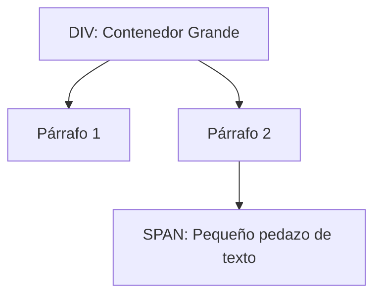

# Lección 05: DIV y SPAN (Contenedores Genéricos)

Estas etiquetas no tienen un significado semántico por sí mismas, pero son esenciales para agrupar contenido y aplicar estilos.

## 1. `<div>` (Block-level)
Es un contenedor de **bloque**. Siempre comienza en una línea nueva y ocupa todo el ancho disponible. Se usa para agrupar grandes secciones de contenido.

## 2. `<span>` (Inline)
Es un contenedor en **línea**. No comienza en una línea nueva y solo ocupa el ancho necesario. Se usa para estilar partes específicas dentro de un texto (como una sola palabra).

### Ejemplo Comparativo
```html
<div class="seccion-calculos">
    <p>La suma es: <span class="resultado">15</span></p>
</div>
```

### Visualización


---
[[02-04-clases-de-estilo|<- Anterior]] | [[00-indice-curso|Índice]] | [[02-06-selectores|Siguiente: Selectores CSS ->]]
