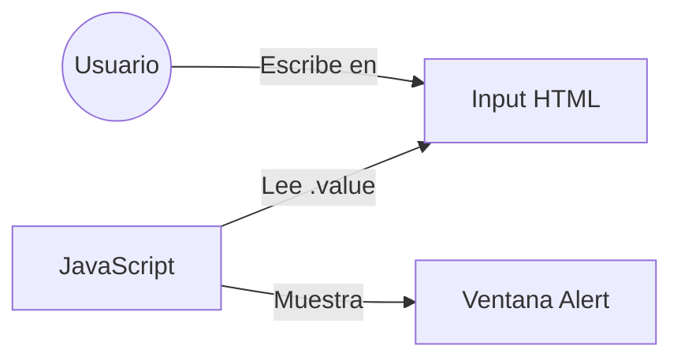

# Lección 02: Ingreso de Usuario

Para que una aplicación sea útil, debe poder recibir información del usuario.

## Capturando Datos
Usamos etiquetas `<input>` para que el usuario escriba y el DOM para leer ese valor desde JavaScript.



### Ejemplo de Código
```html
<p>Ingresa tu nombre:</p>
<input type="text" id="nombreUsuario">
<button onclick="saludarUsuario()">Saludar</button>

<script>
    function saludarUsuario(){
        // Buscamos el elemento por su ID
        let miNombre = document.getElementById("nombreUsuario");
        // Accedemos a su propiedad .value
        alert("Hola " + miNombre.value);
    }
</script>
```

### El Atributo `.value`
Es fundamental recordar que `document.getElementById` te da el **elemento** entero. Para obtener lo que el usuario escribió, necesitas usar la propiedad `.value`.

---
[[03-01-saludo|<- Anterior]] | [[00-indice-curso|Índice]] | [[03-03-variables|Siguiente: Variables ->]]
