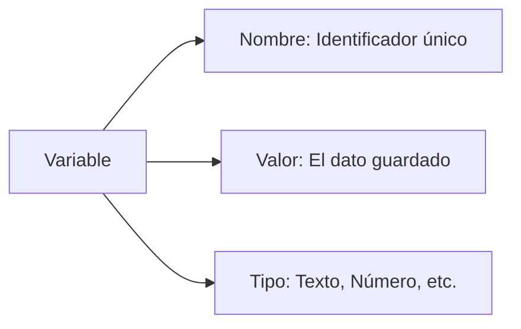

# Lección 03: Variables (let y const)

Las variables son contenedores donde guardamos información que nuestra aplicación necesitará más tarde.

## Declaración de Variables
En JavaScript moderno utilizamos principalmente dos palabras clave:

| Palabra Clave | Comportamiento | Uso |
| --- | --- | --- |
| `let` | El valor **puede** cambiar. | Contadores, entradas de usuario. |
| `const` | El valor **no puede** cambiar. | Nombres, configuraciones, URLs. |

### Ejemplo
```javascript
const miNombre = "Federico"; // No cambiará
let miEdad = 46;             // Puede cambiar

miEdad = 16; // Reasignación válida
// miNombre = "Juan"; // ERROR: No se puede reasignar una constante
```

## Anatomía de una Variable


---
[[03-02-ingreso-de-usuario|<- Anterior]] | [[00-indice-curso|Índice]] | [[03-04-tipos-de-datos|Siguiente: Tipos de Datos ->]]
