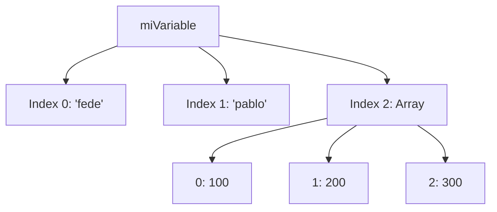

# Lección 04: Tipos de Datos

JavaScript es un lenguaje de **tipado dinámico**, lo que significa que una variable puede cambiar de tipo de dato durante la ejecución.

## Tipos Principales

### 1. Primitivos
- **String (Texto):** `"Hola"`, `'Mundo'`.
- **Number (Números):** `10`, `3.14`.
- **Boolean:** `true`, `false`.
- **Undefined:** Una variable declarada pero sin valor.

### 2. Estructuras de Datos
- **Arrays (Listas):** Colecciones de datos ordenados. Se acceden por índice (empezando en 0).
- **Objetos:** Colecciones de datos por clave-valor.

### Ejemplo de Array Anidado
```javascript
let miVariable;

// Un array que contiene textos y otro array
miVariable = ["fede", "pablo", [100, 200, 300]];

console.log(miVariable[0]);    // "fede"
console.log(miVariable[2][1]); // 200
```



---
[[03-03-variables|<- Anterior]] | [[00-indice-curso|Índice]] | [[03-05-mostrar-ingresos|Siguiente: Mostrar Ingresos ->]]
