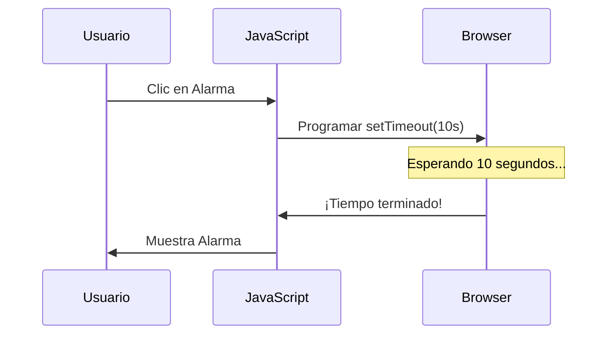

# Lección 06: Temporizadores (`setTimeout`)

JavaScript nos permite programar tareas para que ocurran después de un tiempo determinado.

## La Función `setTimeout`
Esta función recibe dos parámetros:
1. **La función** que quieres ejecutar.
2. **El tiempo** de espera en **milisegundos** (1000ms = 1 segundo).

### Ejemplo: Una Alarma
```javascript
function comenzarTiempo(){
    let segundos = document.getElementById("tiempoElegido").value;
    // Programamos la alarma
    setTimeout(tiempoCumplido, 1000 * segundos);
}

function tiempoCumplido(){
    alert("¡Tiempo cumplido!");
}
```

## Flujo de Ejecución


---
[[03-05-mostrar-ingresos|<- Anterior]] | [[00-indice-curso|Índice]] | [[03-07-sonidos|Siguiente: Sonidos ->]]
