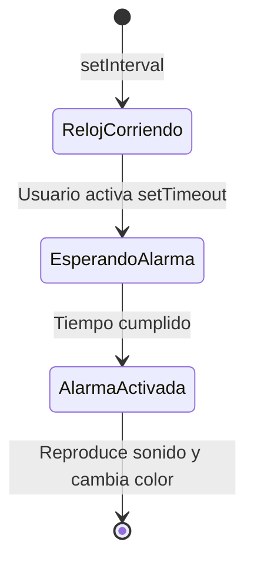

# Lección 09: Proyecto - El Temporizador Maestro

¡Es momento de construir algo real! En este proyecto crearemos una aplicación de alarma completa.

## Objetivo
Desarrollar una aplicación que permita al usuario:
1. Ver la hora actual en tiempo real.
2. Ingresar un tiempo de espera.
3. Activar una alarma que cambie el diseño de la página y reproduzca un sonido al finalizar.

## Flujo de la Aplicación

## Requerimientos Técnicos
- Uso de `let` y `const`.
- Manipulación del DOM (`getElementById`, `textContent`, `.style`).
- Manejo del tiempo (`setTimeout`, `setInterval`).
- Objetos de sistema (`Date`).
- Multimedia (`audio.play()`).

---
[[03-08-fecha-y-hora|<- Anterior]] | [[00-indice-curso|Índice]] | [[Módulo 04: Funciones|Siguiente Módulo ->]]
