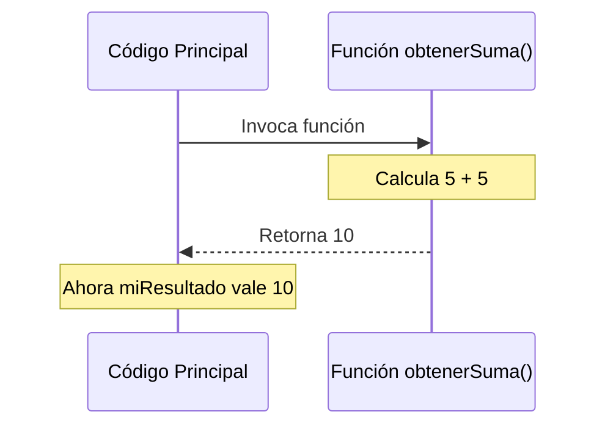

# Lección 02: La Sentencia `return`

El `return` es la forma en que una función nos "devuelve" un resultado después de procesar algo.

## ¿Qué hace el `return`?
1. **Devuelve un valor** a quien llamó a la función.
2. **Finaliza la ejecución** de la función inmediatamente. Cualquier código después de un `return` nunca se ejecutará.

### Ejemplo
```javascript
function obtenerSuma() {
    let resultado = 5 + 5;
    return resultado; // La función termina aquí
    console.log("Esto nunca se verá");
}

// Guardamos el resultado devuelto en una variable
let miResultado = obtenerSuma(); 
alert("La suma es: " + miResultado);
```

### Visualización del Flujo


---
[[04-01-funciones|<- Anterior]] | [[00-indice-curso|Índice]] | [[04-03-parametros|Siguiente: Parámetros ->]]
