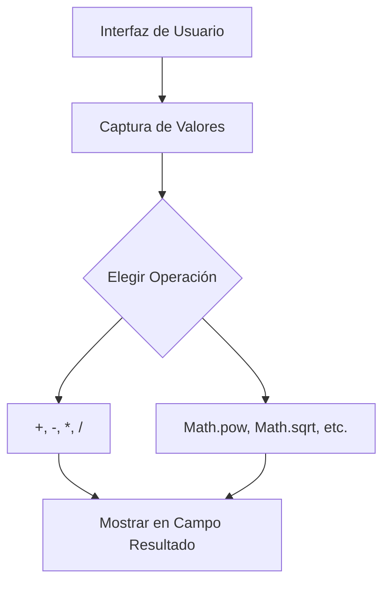

# Lección 07: Proyecto - La Calculadora Científica

Hemos llegado al final de la Parte 1. Para consolidar todo lo aprendido, construiremos una calculadora que maneje operaciones básicas y funciones avanzadas del objeto `Math`.

## El Desafío
Crear una interfaz con dos campos de entrada y botones para realizar:
- Suma, Resta, Multiplicación, División.
- Potencia y Raíz Cuadrada.
- Valor Absoluto.
- Redondeos (`round`, `floor`, `ceil`).
- Generación de números aleatorios.

## Estructura de la Lógica

## Tips para la Implementación
1. **Validación:** Asegúrate de convertir los valores a números con `+`.
2. **Modularidad:** Puedes crear una función genérica que lea los inputs para no repetir código.
3. **Objeto Math:** Recuerda que para la raíz cuadrada es `Math.sqrt()` y para la potencia es `Math.pow()`.

---
[[04-06-random|<- Anterior]] | [[00-indice-curso|Índice]] | [[Módulo 05: Control de Flujo|Siguiente Parte (Parte 2) ->]]
