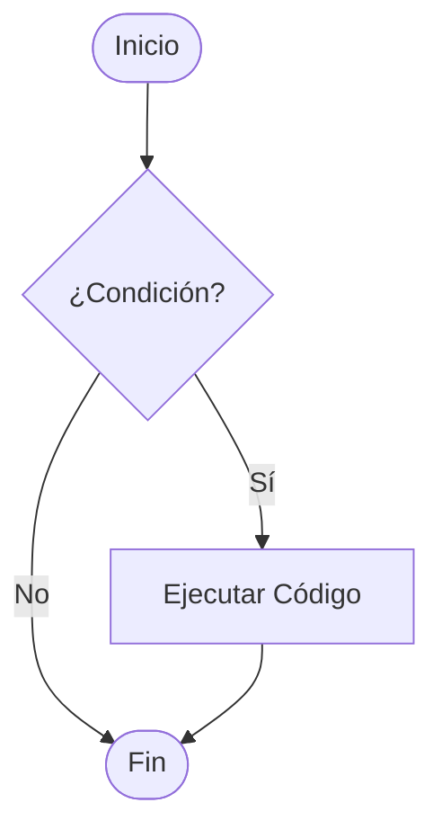

# Lección 02: Declaración If

La sentencia `if` es la estructura básica de control. Permite que el código se ejecute **solo si** se cumple una condición.

## Sintaxis
```javascript
if (condición) {
    // Código que se ejecuta si la condición es verdadera
}
```

## Flujo Lógico


### Ejemplo: El precio de la leche
Queremos decidir si compramos leche basándonos en su precio.

```javascript
function evaluarCompra() {
    let precio = +document.getElementById("textoPrecio").value;
    let elementoDecision = document.getElementById("decision");

    if (precio < 100) {
        elementoDecision.textContent = "¡Comprar 2 unidades!";
    }
}
```

> [!INFO]
> Si la condición es falsa, el bloque de código simplemente se salta y el programa continúa con la siguiente línea después del `if`.

---
[[05-01-operadores-logicos|<- Anterior]] | [[00-indice-curso|Índice]] | [[05-03-if-else|Siguiente: Declaración If-Else ->]]
