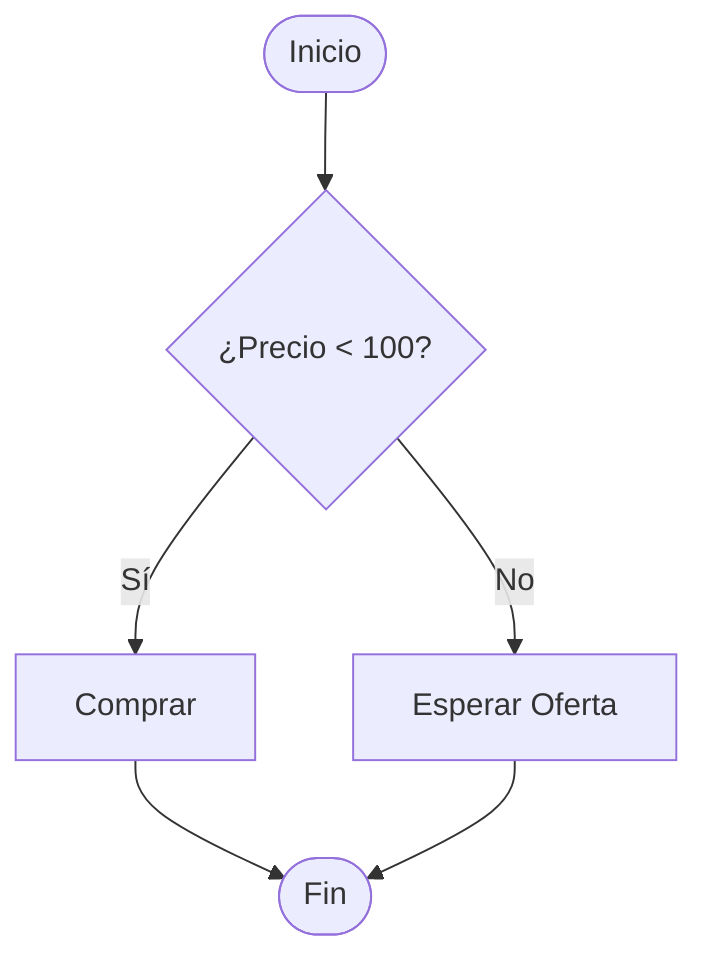

# Lección 03: Declaración If-Else

A menudo no solo queremos hacer algo cuando se cumple una condición, sino también cuando **no** se cumple. Para esto usamos `else`.

## Estructura If-Else
```javascript
if (condición) {
    // Código si es verdadero
} else {
    // Código si es falso
}
```

## Diagrama de Decisiones


### Ejemplo: Evaluación de Compra
```javascript
function evaluarCompra() {
    let precio = +document.getElementById("textoPrecio").value;
    let elementoDecision = document.getElementById("decision");

    if (precio < 100) {
        elementoDecision.textContent = "Comprar ahora";
        elementoDecision.style.color = "green";
    } else {
        elementoDecision.textContent = "Demasiado caro, esperar";
        elementoDecision.style.color = "red";
    }
}
```

---
[[05-02-declaracion-if|<- Anterior]] | [[00-indice-curso|Índice]] | [[05-04-switch|Siguiente: Declaración Switch ->]]
