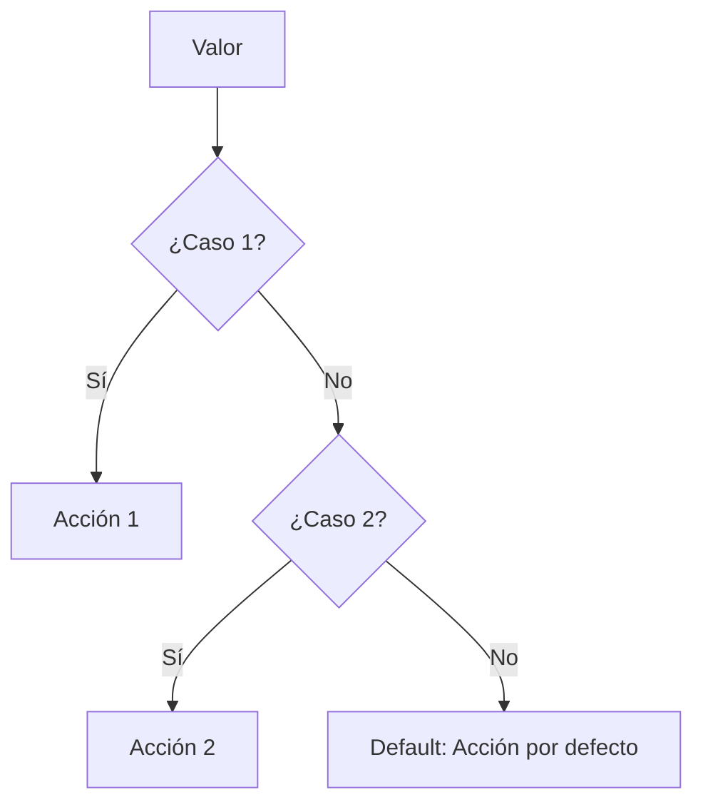

# Lección 04: Declaración Switch

Cuando tenemos múltiples condiciones basadas en un solo valor, usar muchos `if-else` puede volverse desordenado. `switch` es una alternativa más limpia.

## ¿Cómo funciona?
Evalúa una expresión y busca una coincidencia entre varios "casos" (`case`).



### Ejemplo: Precios de Frutas
```javascript
function consultarPrecio() {
    let fruta = +document.getElementById("numeroFruta").value;
    let salida = document.getElementById("textoPrecio");

    switch (fruta) {
        case 1:
            salida.textContent = "$10.50";
            break; // Importante para detener la ejecución
        case 2:
            salida.textContent = "$15.00";
            break;
        case 3:
            salida.textContent = "$8.00";
            break;
        default:
            salida.textContent = "Opción no válida";
    }
}
```

### El rol del `break`
Si olvidas el `break`, JavaScript continuará ejecutando los siguientes casos aunque no coincidan. El `default` se ejecuta si ningún caso anterior tuvo éxito.

---
[[05-03-if-else|<- Anterior]] | [[00-indice-curso|Índice]] | [[05-05-proyecto-flujo|Siguiente: Proyecto de Flujo ->]]
