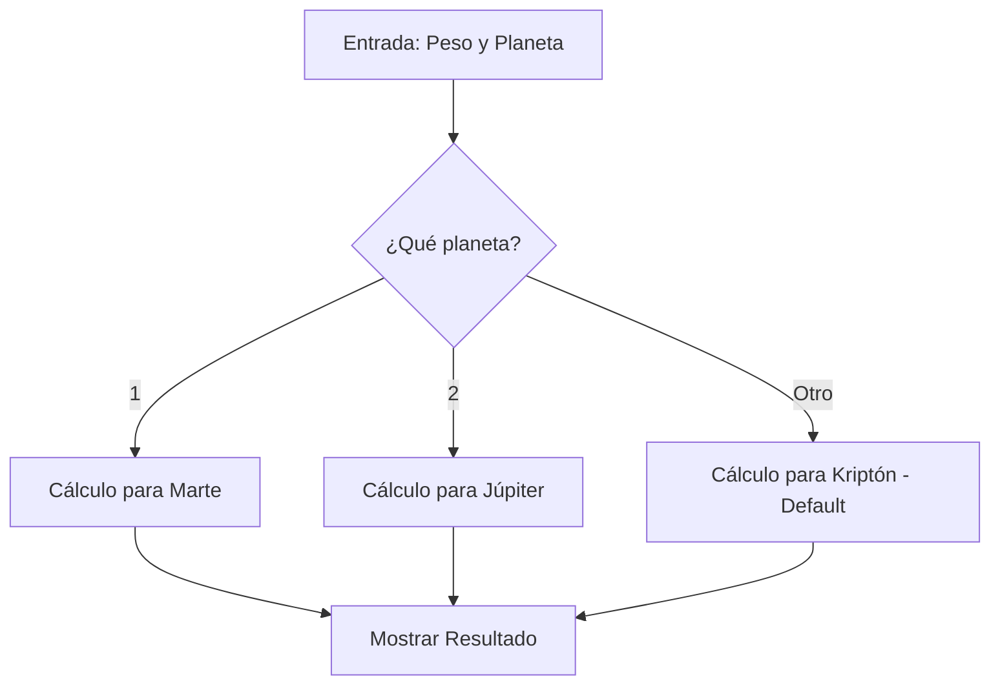

# Lección 05: Proyecto - Tu peso en otro Planeta

En este proyecto integraremos operadores lógicos, `if-else` y entrada de datos para calcular tu peso ideal en diferentes planetas del sistema solar.

## El Concepto
El peso de un objeto cambia según la gravedad del planeta, pero la masa sigue siendo la misma. La fórmula es:
`PesoFinal = (PesoTierra * GravedadPlaneta) / GravedadTierra`

## Gravedades de Referencia
- **Tierra:** 9.8 m/s²
- **Marte:** 3.7 m/s²
- **Júpiter:** 24.8 m/s²

## Lógica del Programa


### Implementación Sugerida
```javascript
let gTierra = 9.8, gMarte = 3.7, gJupiter = 24.8;
let pesoTierra = parseInt(prompt("Ingresa tu peso:"));
let planeta = parseInt(prompt("1: Marte, 2: Júpiter"));

if (planeta == 1) {
    pesoFinal = (pesoTierra * gMarte) / gTierra;
} else if (planeta == 2) {
    pesoFinal = (pesoTierra * gJupiter) / gTierra;
} else {
    pesoFinal = 1000000; // Planeta desconocido
}
```

---
[[05-04-switch|<- Anterior]] | [[00-indice-curso|Índice]] | [[Módulo 06: Bucles|Siguiente Módulo ->]]
