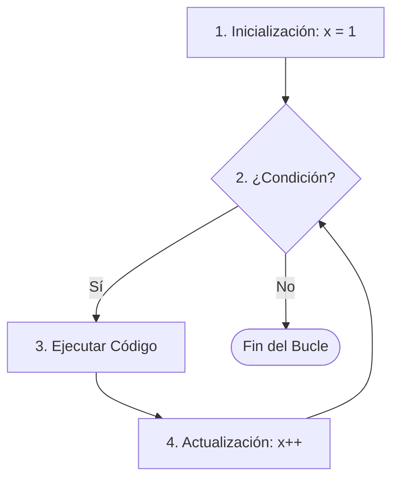

# Lección 02: Bucle For

Un bucle nos permite repetir un bloque de código varias veces de forma automática. El bucle `for` se utiliza cuando sabemos exactamente cuántas veces queremos repetir la acción.

## Anatomía del `for`
```javascript
for (inicialización; condición; actualización) {
    // Código a repetir
}
```



### Ejemplo: Imprimiendo todos los encabezados
```javascript
for (let x = 1; x <= 6; x++) {
    document.write("<h" + x + ">Hola mundo</h" + x + ">");
}
```

### Desglose
1. `let x = 1`: Empezamos con el contador en 1.
2. `x <= 6`: Mientras x sea menor o igual a 6, el bucle sigue.
3. `x++`: Cada vez que termina una vuelta, sumamos 1 a x.

---
[[06-01-consola|<- Anterior]] | [[00-indice-curso|Índice]] | [[06-03-tablas-fizzbuzz|Siguiente: Tablas y FizzBuzz ->]]
