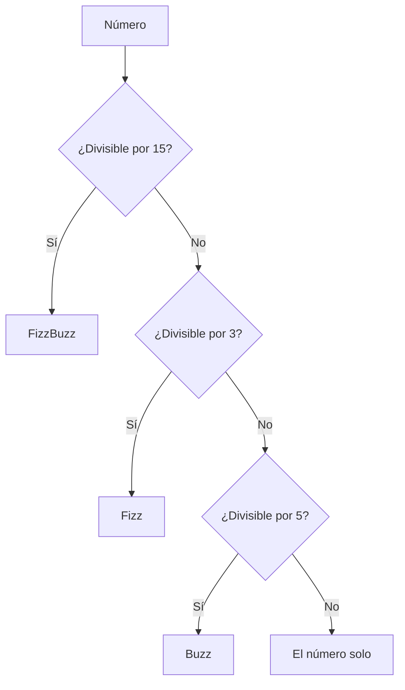

# Lección 03: Práctica de Bucles (Tablas y FizzBuzz)

Poner en práctica los bucles es la mejor forma de entender la lógica de repetición.

## 1. Tablas de Multiplicar
Queremos generar una lista de resultados para cualquier número que el usuario elija.

### Lógica
```javascript
function multiplicar() {
    let tabla = +document.getElementById("textoTabla").value;
    let lista = document.getElementById("listaTabla");
    
    // Limpiamos la lista antes de empezar
    lista.innerHTML = "";

    for (let i = 1; i <= 10; i++) {
        let item = document.createElement("li");
        item.textContent = tabla + " x " + i + " = " + (tabla * i);
        lista.appendChild(item);
    }
}
```

## 2. El Desafío FizzBuzz
Este es un ejercicio clásico de lógica que combina bucles y condicionales.
- Si el número es divisible por **3**, muestra "Fizz".
- Si es divisible por **5**, muestra "Buzz".
- Si es divisible por ambos, muestra "**FizzBuzz**".



---
[[06-02-loop-for|<- Anterior]] | [[00-indice-curso|Índice]] | [[06-04-while|Siguiente: Bucle While ->]]
