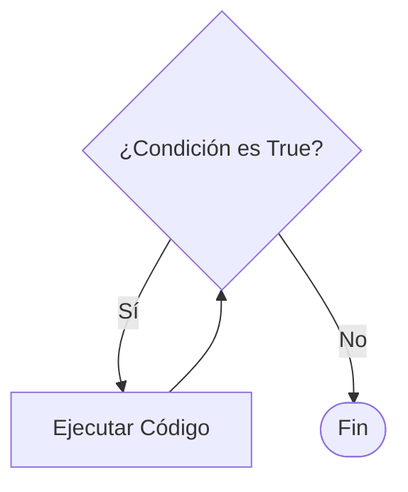

# Lección 04: Bucle While

El bucle `while` (mientras) se utiliza cuando **no sabemos cuántas veces** se debe repetir una acción, pero sí sabemos bajo qué **condición** debe detenerse.

## Funcionamiento
El código dentro del bloque se repetirá mientras la condición sea verdadera.



### Ejemplo: Validación de nombre
```javascript
let nombre = "";

// El bucle seguirá pidiendo el nombre hasta que el usuario escriba "Fede"
while (nombre != "Fede") {
    nombre = prompt("¿Cómo me llamo?");
}

document.write("<h1>Acceso concedido, hola " + nombre + "</h1>");
```

> [!DANGER]
> **Bucle Infinito:** Si la condición nunca se vuelve falsa, el bucle se ejecutará para siempre y bloqueará el navegador. Asegúrate siempre de que algo dentro del bucle cambie la condición.

---
[[06-03-tablas-fizzbuzz|<- Anterior]] | [[00-indice-curso|Índice]] | [[06-05-do-while|Siguiente: Bucle Do-While ->]]
