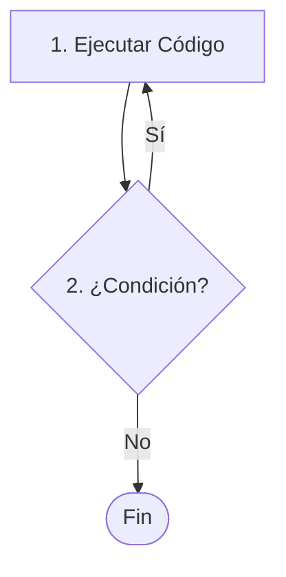

# Lección 05: Bucle Do-While

El bucle `do-while` es muy similar al `while`, con una diferencia crucial: el código se ejecuta **al menos una vez**, ya que la condición se evalúa al final.

## Diferencia con `while`
- **While:** Evalúa -> Ejecuta. (Si la condición es falsa al inicio, nunca se ejecuta).
- **Do-While:** Ejecuta -> Evalúa. (Se ejecuta una vez y luego decide si repite).



### Ejemplo: Pedir datos
```javascript
let nombre;

do {
    // Esto se ejecutará sí o sí la primera vez
    nombre = prompt("Dime mi nombre");
} while (nombre != "Fede");

document.write("<h1>¡Correcto!</h1>");
```

---
[[06-04-while|<- Anterior]] | [[00-indice-curso|Índice]] | [[06-06-for-of|Siguiente: Bucle For-Of ->]]
