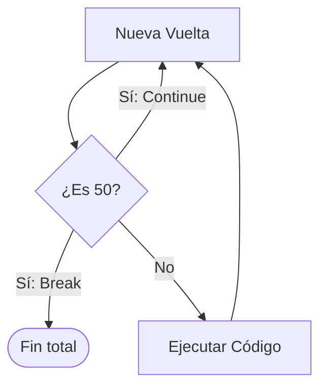

# Lección 07: Control de Saltos (Break y Continue)

A veces necesitamos alterar el flujo normal de un bucle basándonos en una condición interna.

## 1. `break`
**Rompe** el bucle por completo. La ejecución salta a la primera línea después del bucle.

```javascript
for (let i = 1; i <= 10; i++) {
    if (i === 5) break; // Se detiene al llegar a 5
    console.log(i); // Imprimirá: 1, 2, 3, 4
}
```

## 2. `continue`
**Salta** la vuelta actual y pasa directamente a la siguiente iteración.

```javascript
for (let i = 1; i <= 5; i++) {
    if (i === 3) continue; // Salta el número 3
    console.log(i); // Imprimirá: 1, 2, 4, 5
}
```

### Visualización


---
[[06-06-for-of|<- Anterior]] | [[00-indice-curso|Índice]] | [[06-08-calificaciones|Siguiente: Proyecto Calificaciones ->]]
