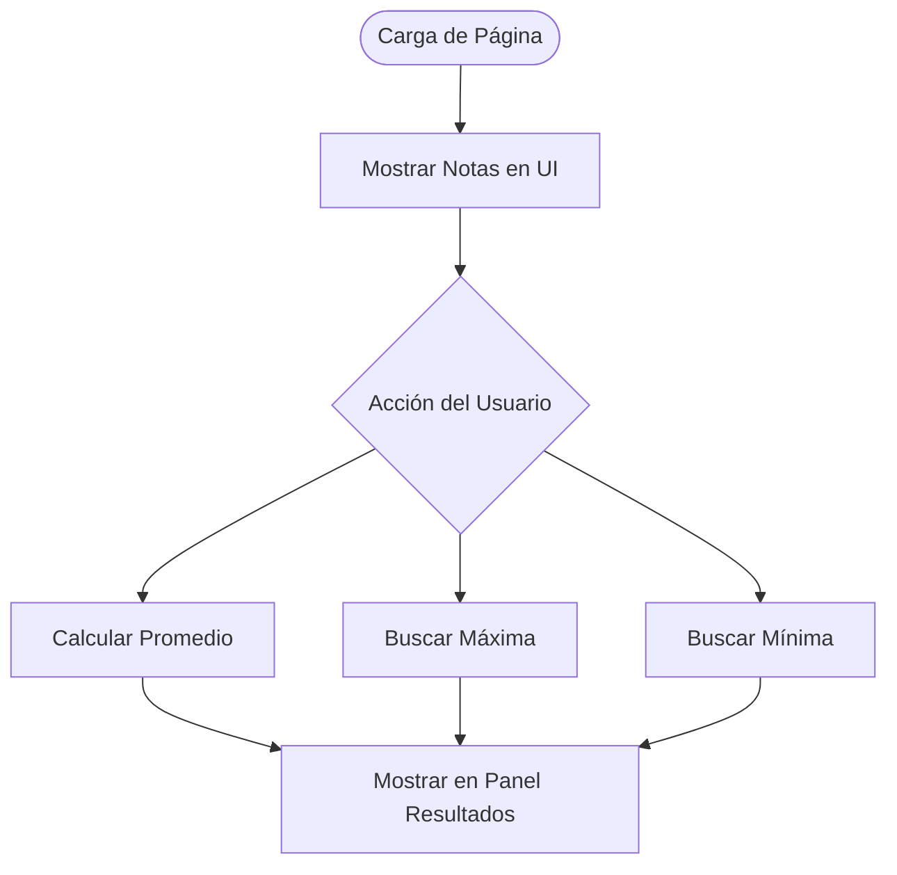

# Lección 08: Proyecto - Boletín de Calificaciones

Este proyecto aplica bucles para procesar una lista de datos (Arrays) y obtener estadísticas útiles.

## El Escenario
Tenemos un Array con las notas de un estudiante y queremos calcular automáticamente:
1. El **promedio**.
2. La **nota más alta**.
3. Detectar si hay algún **aplazado** (nota menor a 4).

## Conceptos a Aplicar
- **Recorrido de Arrays:** Usar `for-of` para visitar cada nota.
- **Acumuladores:** Variables para sumar totales (promedio).
- **Comparadores:** Lógica para encontrar máximos y mínimos.

### Lógica de Cálculo
```javascript
let notas = [7, 8, 4, 10, 2];

// Calcular Promedio
let suma = 0;
for (let nota of notas) {
    suma += nota;
}
let promedio = suma / notas.length;

// Encontrar la más alta
let masAlta = 0;
for (let nota of notas) {
    if (nota > masAlta) {
        masAlta = nota;
    }
}
```

## Flujo del Proyecto


---
[[06-07-break-continue|<- Anterior]] | [[00-indice-curso|Índice]] | [[Módulo 07: Proyecto Tienda de Donas|Siguiente Módulo ->]]
