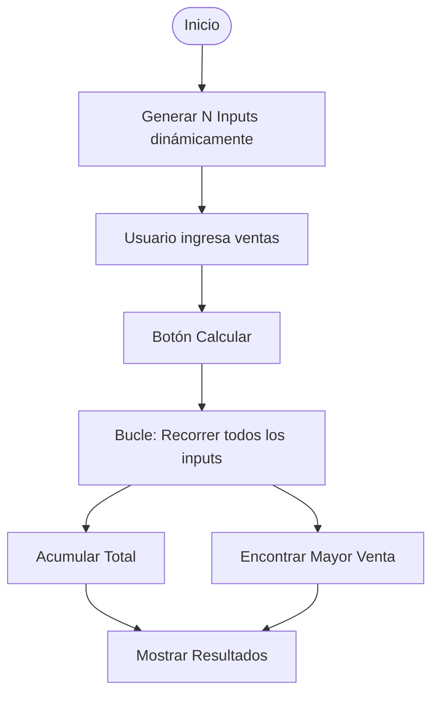

# Lección 01: Lógica de la Tienda de Donas

Este proyecto representa la culminación de la lógica de programación básica. Veremos cómo una aplicación evoluciona desde un código rígido hacia uno dinámico y escalable.

## Evolución del Proyecto

### Fase 1: Estática (Módulo 01-05)
En las primeras versiones, cada tienda tenía su propio `input` con un ID único (`ventasTienda1`, `ventasTienda2`, etc.). Esto hacía que el código fuera difícil de mantener si agregábamos más tiendas.

### Fase 2: Dinámica (Módulo 06-07)
Utilizamos **bucles** para generar la interfaz y procesar los datos.



## Conceptos Clave Aplicados
1. **Arrays de Elementos:** Usamos `document.getElementsByTagName('input')` para obtener todos los campos a la vez.
2. **Acumuladores:** `let total = 0;` que se incrementa en cada vuelta del bucle.
3. **Lógica de Máximos:** Comparar el valor actual con una variable `mayorVenta` para encontrar el récord del día.

### Ejemplo de Lógica Central
```javascript
function calcular() {
    let inputs = document.getElementsByTagName('input');
    let total = 0;
    let mayor = 0;

    for (let input of inputs) {
        let valor = +input.value;
        total += valor;
        if (valor > mayor) {
            mayor = valor;
        }
    }
    
    document.getElementById("resultados").textContent = 
        "Total: " + total + " | Mayor venta: " + mayor;
}
```

---
[[06-08-calificaciones|<- Anterior]] | [[00-indice-curso|Índice]] | [[Módulo 08: POO|Siguiente Parte (Parte 3) ->]]
