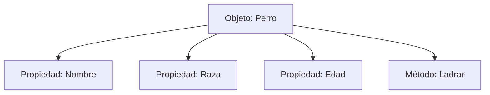

# Lección 01: Introducción a Objetos

En JavaScript, un **Objeto** es una colección de propiedades y métodos que representan una entidad del mundo real o un concepto abstracto.

## ¿Qué es un Objeto?
Imagina un objeto como un contenedor que agrupa variables (propiedades) y funciones (métodos) relacionadas.



### Sintaxis de un Objeto Literal
Utilizamos llaves `{}` para definir el objeto y pares de `llave: valor` para sus propiedades.

```javascript
let perro = {
    nombre: "Simba",
    raza: "Shih Tzu",
    edad: 4,
    
    // Un método es una función dentro de un objeto
    ladrar() {
        console.log("Guau");
    }
}
```

## Acceso a Propiedades
Podemos acceder a la información del objeto usando la **notación de punto**:

- `perro.nombre` -> Devuelve "Simba"
- `perro.edad` -> Devuelve 4
- `perro.ladrar()` -> Ejecuta la función y muestra "Guau" en consola.

### Concepto Didáctico: Propiedades vs Métodos
- **Propiedades:** Son las características o "sustantivos" del objeto (¿Cómo es?).
- **Métodos:** Son las acciones o "verbos" que el objeto puede realizar (¿Qué hace?).

---
[[07-01-tienda-donas|<- Anterior]] | [[00-indice-curso|Índice]] | [[08-02-modificar-objetos|Siguiente ->]]
