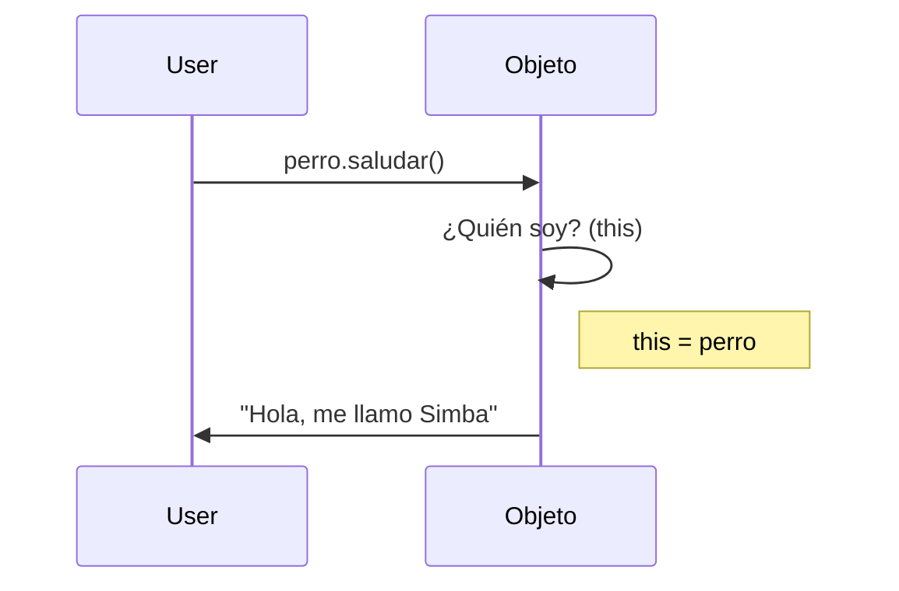

# Lección 03: La palabra clave "This"

La palabra clave `this` es fundamental en la POO de JavaScript. Se utiliza dentro de los métodos de un objeto para referirse **al propio objeto** en el que se encuentra.

## ¿Para qué sirve This?
Cuando tenemos múltiples objetos con la misma estructura, `this` nos permite acceder a las propiedades del objeto actual sin tener que escribir su nombre explícitamente.

### Ejemplo de Uso
Si no usáramos `this`, tendríamos que escribir el nombre de la variable, lo cual daría problemas si cambiamos el nombre o si el código es copiado a otro objeto.

```javascript
let perro = {
    nombre: "Simba",
    saludar() {
        // "this" representa al objeto "perro"
        console.log("Hola, me llamo " + this.nombre);
    }
};

let perro2 = {
    nombre: "Reina",
    saludar() {
        // Aquí "this" representa al objeto "perro2"
        console.log("Hola, me llamo " + this.nombre);
    }
};
```

## Funcionamiento de This
`this` actúa como un puntero o referencia dinámica:



### Regla de Oro
> Dentro de un método, `this` hace referencia al objeto que **invocó** el método.

---
[[08-02-modificar-objetos|<- Anterior]] | [[00-indice-curso|Índice]] | [[08-04-constructor|Siguiente ->]]
