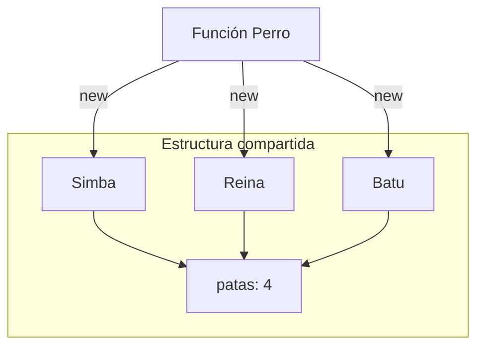

# Lección 04: Funciones Constructoras

Las **Funciones Constructoras** son como plantillas o moldes que nos permiten crear múltiples objetos con la misma estructura (propiedades y métodos) de forma eficiente.

## El Problema de la Repetición
Sin constructores, tendríamos que escribir el objeto entero cada vez que necesitemos uno nuevo:

```javascript
let perro1 = { nombre: "Simba", edad: 4 };
let perro2 = { nombre: "Reina", edad: 15 };
// ... repetir para cada perro
```

## Definición de un Constructor
Un constructor es una función que se define con la primera letra en **Mayúscula** (por convención) y utiliza `this` para asignar propiedades.

```javascript
function Perro() {
    this.patas = 4;
    this.ladrar = function () {
        console.log("Guau");
    };
};
```

## Creación de Objetos con `new`
Para crear un objeto a partir de un constructor, debemos usar la palabra clave `new`.

```javascript
let simba = new Perro();
let reina = new Perro();
let batu = new Perro();
```

### ¿Qué hace `new`?
1. Crea un objeto vacío `{}`.
2. Vincula el `this` de la función a ese nuevo objeto.
3. Devuelve el objeto creado.



---
[[08-03-this|<- Anterior]] | [[00-indice-curso|Índice]] | [[08-05-metodos-constructor|Siguiente ->]]
