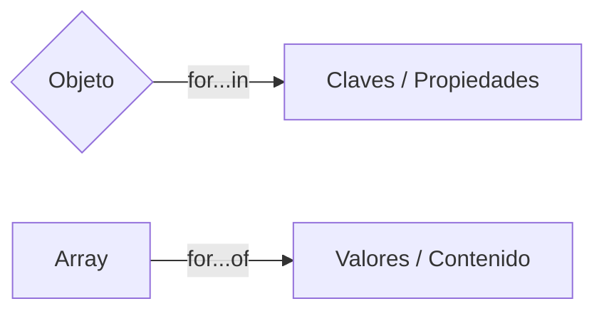

# Lección 07: El Bucle For...in

El bucle `for...in` es una estructura de control diseñada específicamente para recorrer las **propiedades** de un objeto.

## ¿Por qué usar For...in?
A diferencia de un array, donde usamos un índice numérico, los objetos tienen claves (nombres de propiedades). `for...in` nos permite obtener cada una de esas claves automáticamente.

### Ejemplo de Uso
```javascript
let perro = {
    raza: "Cruza",
    edad: 8,
    color: "Negro"
};

for (let propiedad in perro) {
    // 'propiedad' contiene el nombre de la clave (ej: "raza")
    // perro[propiedad] obtiene el valor (ej: "Cruza")
    console.log(propiedad + ": " + perro[propiedad]);
}
```

## Diferencia con For...of
Es importante no confundirlos:
- **`for...in`**: Recorre **claves** (propiedades) de un objeto.
- **`for...of`**: Recorre **valores** de un elemento iterable (como un Array).



### Caso de Uso: Inspección de Objetos
`for...in` es extremadamente útil cuando recibimos un objeto y no sabemos de antemano qué propiedades tiene (por ejemplo, datos que vienen de una base de datos o API).

---
[[08-06-objetos-literales|<- Anterior]] | [[00-indice-curso|Índice]] | [[08-08-registro-empleados|Siguiente ->]]
