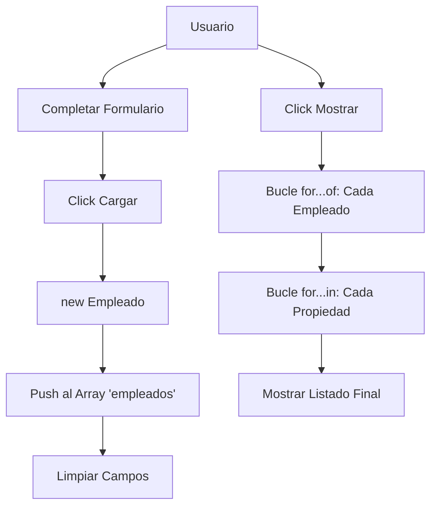

# Lección 08: Proyecto - Registro de Empleados

Este proyecto integra todos los conceptos de la Programación Orientada a Objetos vistos hasta ahora: constructores, instancias, arrays de objetos e iteración dinámica.

## Objetivo
Crear un sistema que permita registrar empleados mediante un formulario, almacenarlos en una lista y mostrar sus datos completos recorriendo sus propiedades.

## Estructura de Datos
Utilizamos un constructor para definir el "molde" del empleado y un array para la base de datos.

```javascript
let empleados = [];

function Empleado(legajo, nombre, apellido, nacimiento, cargo){
    this.legajo = legajo;
    this.nombre = nombre;
    this.apellido = apellido;
    this.nacimiento = nacimiento;
    this.cargo = cargo;
}
```

## Lógica del Proyecto

### 1. Cargar Empleados
Capturamos los datos del DOM, creamos una nueva **instancia** y la guardamos en el array.

```javascript
function agregarEmpleado() {
    let legajo = document.getElementById("txtLegajo").value;
    // ... capturar otros campos
    
    let nuevoEmpleado = new Empleado(legajo, nombre, apellido, nacimiento, cargo);
    empleados.push(nuevoEmpleado);
    
    alert("Empleado agregado correctamente");
}
```

### 2. Mostrar con Bucles Anidados
Para mostrar la información, usamos un bucle `for...of` para recorrer el array y un `for...in` para recorrer cada propiedad del objeto empleado.

```javascript
function mostrarEmpleados() {
    let listado = "";
    
    for(let empleado of empleados) {
        for(let propiedad in empleado) {
            // Recorremos dinámicamente: NOMBRE, APELLIDO, etc.
            listado += propiedad.toUpperCase() + ": " + empleado[propiedad] + "\n";
        }
        listado += "------------------\n";
    }
    alert(listado);
}
```

## Diagrama de Flujo del Sistema



---
[[08-07-for-in|<- Anterior]] | [[00-indice-curso|Índice]] | [[Módulo 09: Prototipos|Siguiente Parte (Módulo 09) ->]]
