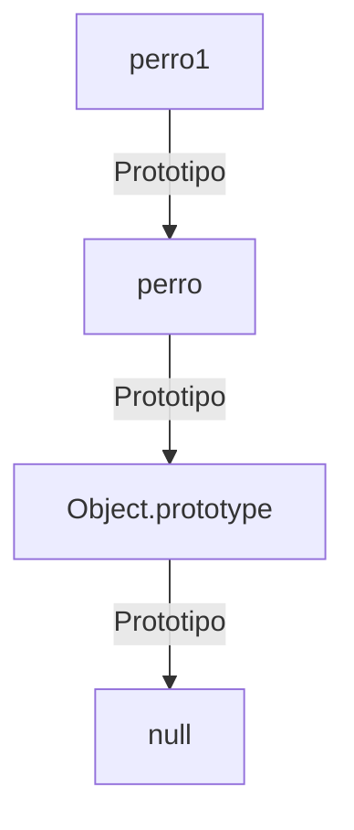

# Lección 01: Concepto de Prototipos

En JavaScript, los **Prototipos** son el mecanismo mediante el cual los objetos heredan características unos de otros. A diferencia de otros lenguajes que usan clases puras (antes de ES6), JavaScript es un lenguaje basado en prototipos.

## ¿Qué es un Prototipo?
Cada objeto en JavaScript tiene una propiedad interna que apunta a otro objeto llamado su **prototipo**. Ese objeto prototipo tiene su propio prototipo, y así sucesivamente hasta que se llega a un objeto con `null` como su prototipo (la **Cadena de Prototipos**).

### Creación de Objetos con Prototipo
Podemos usar `Object.create(prototipo)` para crear un nuevo objeto que herede directamente de otro.

```javascript
let perro = { nombre: "Simba" };

// Creamos un nuevo objeto usando 'perro' como base
let perro1 = Object.create(perro);

console.log(perro1.nombre); // "Simba" (Heredado)
```

## La Cadena de Prototipos
Cuando intentas acceder a una propiedad de un objeto:
1. JS busca la propiedad en el objeto mismo.
2. Si no la encuentra, la busca en su **prototipo**.
3. Si sigue sin encontrarla, sigue subiendo por la cadena hasta llegar a `Object.prototype`.



### Importancia de la Herencia
Este mecanismo permite ahorrar memoria, ya que múltiples objetos pueden compartir el mismo prototipo (y por tanto los mismos métodos) sin tener que duplicar el código en cada instancia.

---
[[08-08-registro-empleados|<- Anterior]] | [[00-indice-curso|Índice]] | [[09-02-objetos-prototipicos|Siguiente ->]]
