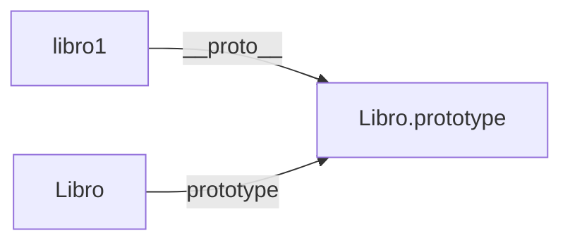

# Lección 02: Objetos Prototípicos

Cuando usamos **Funciones Constructoras**, JavaScript crea automáticamente un objeto prototipo asociado a esa función. Todas las instancias creadas con esa función compartirán ese mismo prototipo.

## Constructores y Prototipos
Cada vez que defines una función constructora, esta tiene una propiedad llamada `.prototype`.

```javascript
function Libro(autor, titulo, cantPaginas){
    this.autor = autor;
    this.titulo = titulo;
    this.cantPaginas = cantPaginas;
}

// Al crear una instancia, esta se vincula al prototipo de Libro
let libro1 = new Libro("Stephen King", "Carrie", 524);
```

### Relación entre Instancia y Constructor
Podemos visualizar la conexión entre el objeto creado y su "molde" original:



## Ventajas de usar Objetos Prototípicos
1. **Eficiencia de Memoria:** Si definimos métodos en el prototipo, solo existe una copia de la función en memoria, sin importar cuántos libros creemos.
2. **Consistencia:** Si actualizamos el prototipo, todos los objetos creados anteriormente recibirán la actualización automáticamente.

### Ejemplo de Inspección
Si en la consola del navegador escribes `libro1`, verás sus propiedades. Si buscas más abajo, verás una propiedad oculta (usualmente `[[Prototype]]` o `__proto__`) que contiene el ADN del objeto `Libro`.

---
[[09-01-prototipos|<- Anterior]] | [[00-indice-curso|Índice]] | [[09-03-modificar-prototipos|Siguiente ->]]
