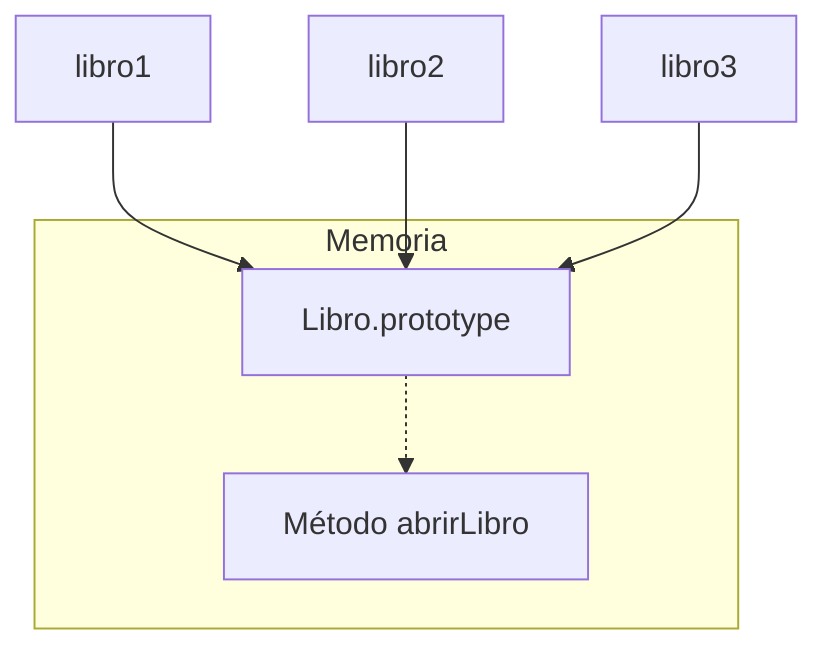

# Lección 03: Modificar Prototipos

Una de las características más poderosas de JavaScript es la capacidad de modificar los prototipos en tiempo de ejecución. Esto permite agregar métodos y propiedades a todos los objetos de un tipo a la vez.

## Agregar Métodos al Prototipo
En lugar de definir los métodos dentro del constructor (lo que crearía una copia de la función por cada objeto), es mejor definirlos en el `.prototype`.

```javascript
function Libro(autor, titulo, cantPaginas){
    this.autor = autor;
    this.titulo = titulo;
    this.cantPaginas = cantPaginas;
}

// Agregamos un método compartido
Libro.prototype.abrirLibro = function() {
    console.log(this.titulo + " ha sido abierto");
};

let libro1 = new Libro("Stephen King", "Carrie", 524);
libro1.abrirLibro(); // Funciona porque lo hereda del prototipo
```

## Beneficios del Prototipo
- **Ahorro de recursos:** El método `abrirLibro` existe solo una vez en memoria.
- **Dinamismo:** Si agregamos un método al prototipo después de haber creado los objetos, esos objetos ya existentes **podrán usar el nuevo método inmediatamente**.



## Propiedades en el Prototipo
También se pueden agregar propiedades, aunque usualmente se prefiere que las propiedades únicas (como el título) estén en la instancia y las propiedades compartidas o métodos estén en el prototipo.

```javascript
Libro.prototype.genero = "Ficción";
```

---
[[09-02-objetos-prototipicos|<- Anterior]] | [[00-indice-curso|Índice]] | [[09-04-registro-automotor|Siguiente ->]]
