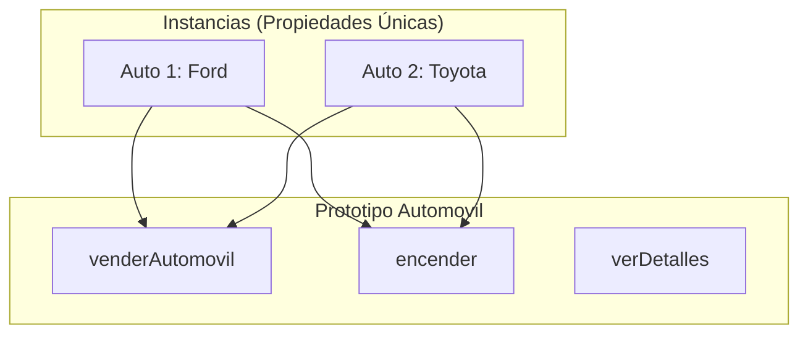

# Lección 04: Proyecto - Registro Automotor

Este proyecto utiliza **Prototipos** para gestionar una flota de vehículos. Al usar prototipos, aseguramos que todos los automóviles compartan métodos de funcionalidad (como vender o encender) sin duplicar el código.

## Estructura del Automóvil
Definimos las propiedades básicas en el constructor y el comportamiento en el prototipo.

```javascript
function Automovil(marca, modelo, color, anio, titular){
    this.marca = marca;
    this.modelo = modelo;
    this.color = color;
    this.anio = anio;
    this.titular = titular;
}

// Métodos en el Prototipo
Automovil.prototype.venderAutomovil = function(nuevoTitular) {
    this.titular = nuevoTitular;
};

Automovil.prototype.verDetalles = function() {
    return `${this.marca} ${this.modelo} (${this.anio}) - Dueño: ${this.titular}`;
};
```

## Lógica de Gestión
El sistema permite registrar nuevos autos, listarlos e interactuar con ellos mediante un índice.

### 1. Registro
```javascript
function registrarAutomovil() {
    let auto = new Automovil(
        document.getElementById("marca").value,
        document.getElementById("modelo").value,
        // ... otros campos
    );
    registroAutomoviles.push(auto);
}
```

### 2. Acciones por Índice
Podemos realizar acciones sobre un vehículo específico de la lista usando su posición (índice).

```javascript
function venderAutomovil() {
    let indice = +document.getElementById("indexAuto").value;
    let nuevoTitular = document.getElementById("nuevoTitular").value;

    if (registroAutomoviles[indice]) {
        registroAutomoviles[indice].venderAutomovil(nuevoTitular);
    }
}
```

## Diagrama de la Estructura Prototípica



### Conceptos Aplicados
- **Herencia Prototípica:** Los autos no "tienen" el método vender, lo "buscan" en su prototipo.
- **Acceso por Índice:** Uso de arrays para gestionar múltiples instancias.
- **Manipulación del DOM:** Actualización de listas y mensajes en tiempo real.

---
[[09-03-modificar-prototipos|<- Anterior]] | [[00-indice-curso|Índice]] | [[Módulo 10: Clases|Siguiente Parte (Módulo 10) ->]]
