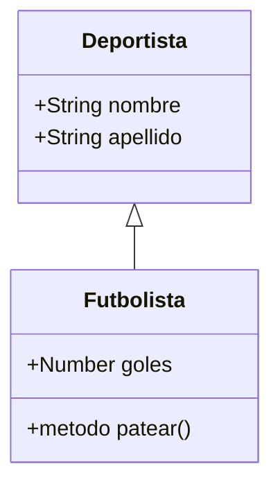

# Lección 02: Herencia y Subclases

La **Herencia** permite que una clase (subclase) obtenga todas las propiedades y métodos de otra clase (clase padre o superclase), evitando la duplicación de código.

## La palabra clave `extends`
Usamos `extends` para indicar que una clase hereda de otra.

```javascript
class Deportista {
    constructor(nombre, apellido) {
        this.nombre = nombre;
        this.apellido = apellido;
    }
}

// Futbolista hereda de Deportista
class Futbolista extends Deportista {
    // ...
}
```

## El método `super()`
Cuando una subclase tiene su propio constructor, debemos llamar a `super()` antes de usar `this`. Esto ejecuta el constructor de la clase padre.

```javascript
class Futbolista extends Deportista {
    constructor(nombre, apellido, goles) {
        // Llama al constructor de Deportista para asignar nombre y apellido
        super(nombre, apellido); 
        this.goles = goles; // Propiedad única de Futbolista
    }
}
```

## Diagrama de Herencia



### ¿Por qué es útil?
Si mañana queremos crear una clase `Tenista`, no necesitamos volver a definir `nombre` y `apellido`; simplemente extendemos de `Deportista`.

---
[[10-01-clases|<- Anterior]] | [[00-indice-curso|Índice]] | [[10-03-getters-setters|Siguiente ->]]
