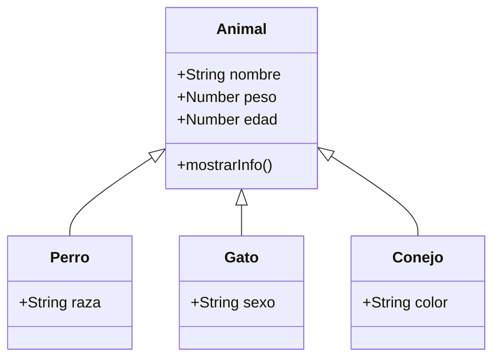

# Lección 04: Proyecto - Veterinaria

Este proyecto es la culminación de la Programación Orientada a Objetos mediante clases. Implementaremos un sistema de gestión para una veterinaria que maneja diferentes tipos de animales compartiendo una base común.

## Arquitectura de Clases

Utilizamos una **Clase Base** (`Animal`) para las propiedades comunes y **Subclases** para las características específicas de cada especie.



### Clase Base: Animal
```javascript
class Animal {
    constructor(nombre, peso, edad) {
        this._nombre = nombre;
        this._peso = peso;
        this._edad = edad;
    }
    
    mostrarInfo() {
        return `Nombre: ${this._nombre} | Peso: ${this._peso} | Edad: ${this._edad}`;
    }
}
```

### Subclase y Extensión de Métodos
En las subclases, usamos `super` tanto en el constructor como para extender la funcionalidad de los métodos del padre.

```javascript
class Perro extends Animal {
    constructor(nombre, peso, edad, raza) {
        super(nombre, peso, edad);
        this._raza = raza;
    }
    
    // Sobrescribimos el método para agregar la raza
    mostrarInfo() {
        let mensaje = super.mostrarInfo(); // Obtenemos el mensaje base
        return mensaje + ` | Raza: ${this._raza}`;
    }
}
```

## Lógica del Sistema
El sistema permite:
1. **Instanciar** objetos de forma dinámica según la especie.
2. **Almacenar** las mascotas en listas separadas (`perros`, `gatos`, `conejos`).
3. **Listar** la información en el DOM usando bucles `for...of`.

### Ejemplo de Registro
```javascript
function registrarPerro() {
    let perro = new Perro(inputNombre, inputPeso, inputEdad, inputRaza);
    perros.push(perro);
    alert("Perro registrado con éxito");
}
```

## Conceptos Clave Aplicados
- **Herencia:** Reutilización de la lógica de `Animal`.
- **Polimorfismo:** El método `mostrarInfo()` se comporta de forma diferente dependiendo de si el animal es un Perro, Gato o Conejo.
- **Encapsulamiento:** Uso de `_` para propiedades y `get/set` para acceder a ellas.

---
[[10-03-getters-setters|<- Anterior]] | [[00-indice-curso|Índice]] | [[Módulo 11: Manejo de Excepciones|Siguiente Parte (Parte 4) ->]]
