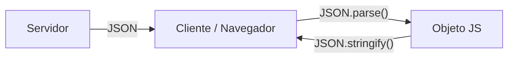

# Lección 01: ¿Qué es JSON?

**JSON** (JavaScript Object Notation) es un formato de texto ligero para el intercambio de datos. Aunque se basa en la sintaxis de objetos de JavaScript, es independiente del lenguaje y puede ser leído por casi cualquier lenguaje de programación.

## Características de JSON
1. **Texto plano:** Es fácil de leer para humanos y máquinas.
2. **Estructura de Datos:** Utiliza pares de `clave: valor`.
3. **Estándar Web:** Es el formato más usado para comunicar un cliente (navegador) con un servidor (API).



### Ejemplo de un archivo `persona.json`
```json
{
    "nombre": "Federico",
    "apellido": "García",
    "edad": 35,
    "esEstudiante": false,
    "hobbies": ["Programar", "Leer", "Correr"]
}
```

## Consumir JSON (Método Antiguo: XMLHttpRequest)
Antes de la llegada de `fetch`, se utilizaba `XMLHttpRequest` para pedir archivos JSON.

```javascript
let xhr = new XMLHttpRequest();
xhr.open('GET', "persona.json", true);
xhr.responseType = 'json'; // Le indicamos que el formato es JSON

xhr.onload = function() {
    if(xhr.status === 200) {
        let datos = xhr.response;
        console.log(datos.nombre); // "Federico"
    }
}
xhr.send();
```

> **Importante:** Las claves en un archivo `.json` **siempre** deben ir entre comillas dobles (`"`).

---
[[10-04-veterinaria|<- Anterior]] | [[00-indice-curso|Índice]] | [[11-02-fetch|Siguiente ->]]
