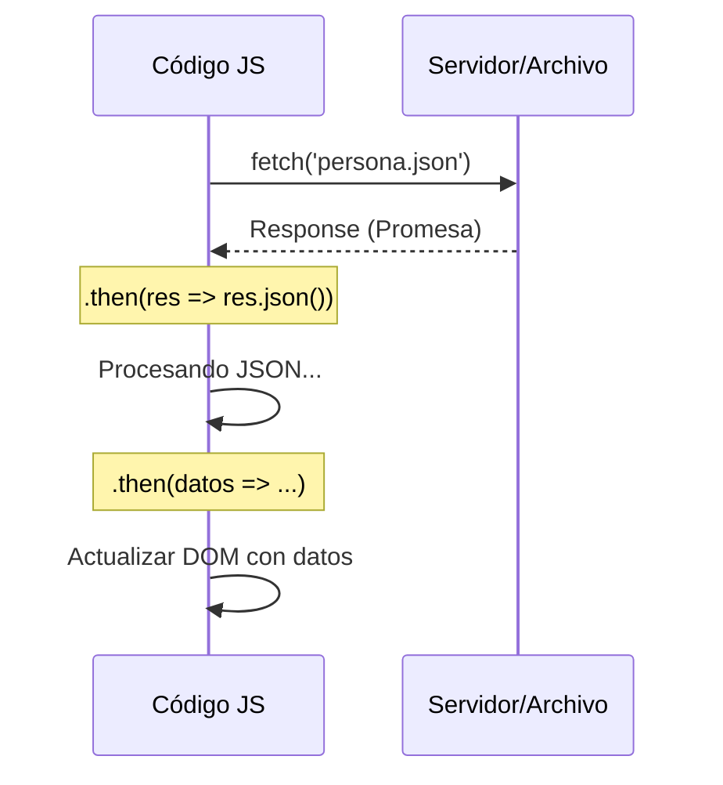

# Lección 02: Peticiones con Fetch

La API **Fetch** es la forma moderna, limpia y basada en promesas de realizar peticiones HTTP en JavaScript. Reemplaza al antiguo `XMLHttpRequest` con una sintaxis mucho más legible.

## ¿Cómo funciona Fetch?
`fetch()` devuelve una **Promesa**. Una promesa es un objeto que representa la terminación (o el fracaso) de una operación asíncrona.

```javascript
fetch('persona.json')
    .then(respuesta => respuesta.json()) // Paso 1: Convertir la respuesta a JSON
    .then(datos => {                      // Paso 2: Usar los datos
        console.log(datos.nombre);
        document.getElementById('nombre').textContent = datos.edad;
    });
```

### El proceso de Fetch



## Ventajas de Fetch
1. **Sintaxis encadenada:** Usa `.then()` para manejar el flujo de datos.
2. **Basado en Promesas:** Permite un manejo más potente de la asincronía.
3. **Puntualidad:** Solo se ejecuta cuando la respuesta está lista, sin bloquear el resto del código.

> **Nota:** Por defecto, `fetch` realiza peticiones tipo `GET`. En módulos avanzados veremos cómo enviar datos mediante `POST`.

---
[[11-01-json|<- Anterior]] | [[00-indice-curso|Índice]] | [[11-03-try-catch|Siguiente ->]]
