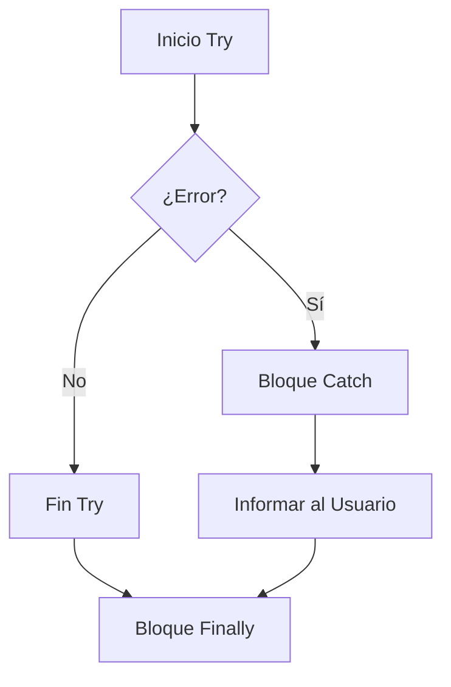

# Lección 03: Manejo de Errores (Try/Catch y Catch)

En programación, los errores son inevitables (un servidor caído, un archivo que no existe, un dato mal escrito). El **Manejo de Excepciones** nos permite capturar esos errores para que la aplicación no se detenga bruscamente.

## 1. El método `.catch()` en Fetch
Cuando usamos `fetch`, si la petición falla (por ejemplo, por falta de internet o un error de red), la promesa se "rechaza". Podemos capturar ese fallo usando `.catch()`.

```javascript
fetch('archivo_inexistente.json')
    .then(res => res.json())
    .then(datos => console.log(datos))
    .catch(error => {
        console.error("Hubo un error en la petición: ", error);
        alert("No se pudo cargar la información.");
    });
```

## 2. Bloque Try...Catch
Para errores en código síncrono (lógica general), utilizamos la estructura `try...catch`.

```javascript
try {
    // Código que podría fallar
    let resultado = funcionQueNoExiste();
} catch (error) {
    // Código que se ejecuta si hay un error
    console.log("Se produjo un error: " + error.message);
} finally {
    // (Opcional) Código que se ejecuta siempre, haya error o no
    console.log("Intento de ejecución finalizado.");
}
```

## Comparativa de Manejo de Errores

| Método | Uso Principal |
| :--- | :--- |
| **`.catch()`** | Para manejar promesas (Fetch, Bases de Datos). |
| **`try...catch`** | Para manejar errores de lógica o funciones en tiempo real. |



---
[[11-02-fetch|<- Anterior]] | [[00-indice-curso|Índice]] | [[11-04-cuenta-bancaria|Siguiente ->]]
