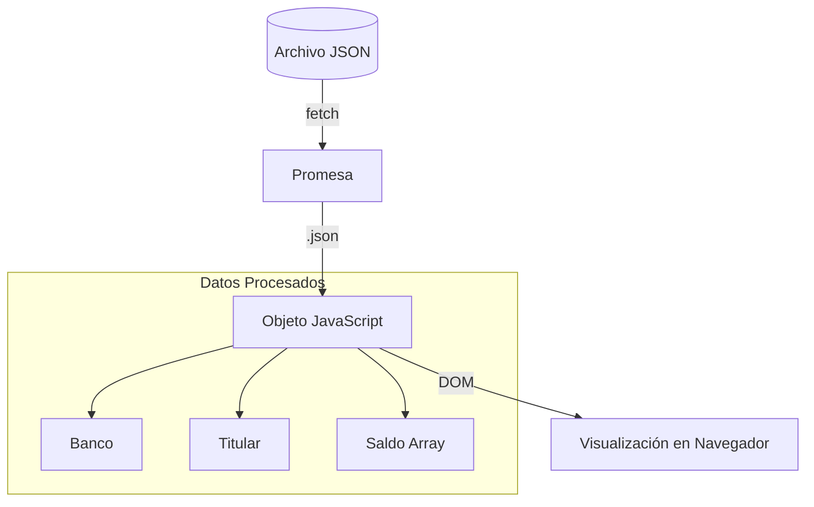

# Lección 04: Proyecto - Simulación Bancaria

Este proyecto aplica el uso de **Fetch** y **JSON** para simular la carga de datos de una cuenta bancaria desde un servidor externo (representado por un archivo `.json`).

## Estructura del JSON de Datos
Es importante entender cómo están organizados los datos para poder acceder a ellos correctamente, especialmente cuando hay arrays anidados (como en el caso del saldo).

```json
{
    "banco": "Banco de Springfield",
    "titular": "Torres Manuel",
    "saldo": [ 
        { "moneda": "USD", "monto": 725.09 }, 
        { "moneda": "EUR", "monto": 195.67} 
    ]
}
```

## Lógica de Carga Dinámica
Utilizamos una función que se dispara al cargar la página (`onload`) para obtener los datos y repartirlos en el HTML.

```javascript
function cargarResumen() {
    fetch("resumen.json")
    .then(respuesta => respuesta.json())
    .then(function(salida) {
        // Acceso directo a propiedades
        document.getElementById("banco").textContent = salida.banco;
        document.getElementById("titular").textContent = salida.titular;

        // Acceso a elementos de un Array
        document.getElementById("usd").textContent = salida.saldo[0].monto + " " + salida.saldo[0].moneda;
        document.getElementById("eur").textContent = salida.saldo[1].monto + " " + salida.saldo[1].moneda;
    })
    .catch(error => console.error("Error al cargar datos:", error));
}
```

## Flujo de Información



### Conceptos Clave Reforzados
- **Asincronía:** El resto de la página carga mientras el `fetch` espera la respuesta del servidor.
- **Acceso anidado:** Uso de índices `[0]` para navegar por listas dentro de objetos JSON.
- **Manejo de Errores:** Uso de `.catch()` para evitar que la aplicación falle si el archivo no se encuentra.

---
[[11-03-try-catch|<- Anterior]] | [[00-indice-curso|Índice]] | [[Módulo 12: Eventos|Siguiente Parte (Módulo 12) ->]]
