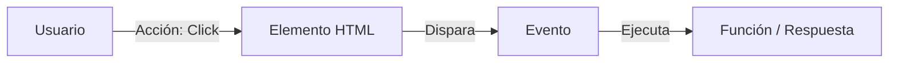

# Lección 01: Introducción a Eventos

Un **Evento** es cualquier acción que ocurre en el navegador, ya sea provocada por el usuario (un click, mover el ratón, presionar una tecla) o por el propio sistema (la página terminó de cargar, un error de red).

## ¿Qué es el Modelo de Eventos?
JavaScript permite "escuchar" estos eventos y ejecutar código como respuesta. Esto es lo que hace que la web sea interactiva.



## Formas de Manejar Eventos

### 1. Atributos HTML (No recomendado)
Consiste en escribir el código directamente en el HTML. Se considera una mala práctica porque mezcla la estructura con la lógica.
```html
<button onclick="alert('Hola')">Click aquí</button>
```

### 2. Propiedad del Objeto (Nivel 0)
Asignamos una función a la propiedad del elemento en JavaScript.
```javascript
let boton = document.getElementById("miBoton");

boton.onclick = function() {
    alert("Has hecho click");
};
```

## El Objeto Event
Cuando ocurre un evento, el navegador crea automáticamente un **Objeto Event** que contiene información útil sobre lo que pasó:
- ¿Qué tecla se presionó?
- ¿En qué coordenadas estaba el ratón?
- ¿Qué elemento disparó el evento?

---
[[11-04-cuenta-bancaria|<- Anterior]] | [[00-indice-curso|Índice]] | [[12-02-addEventListener|Siguiente ->]]
